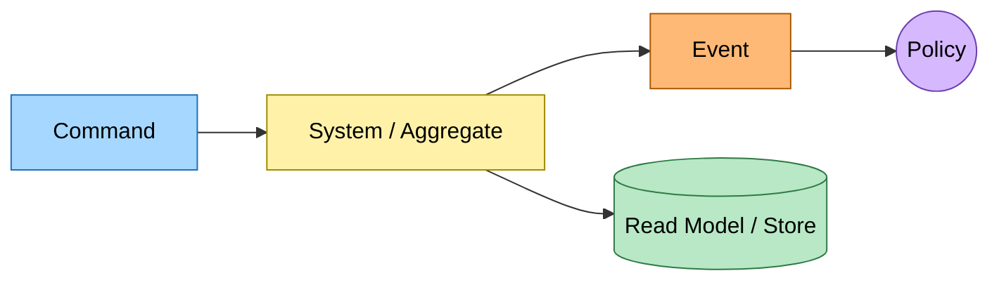
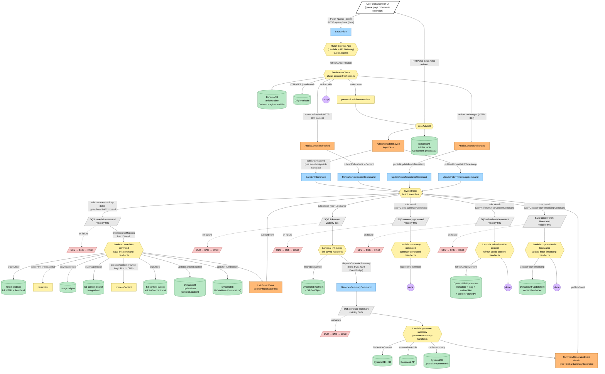
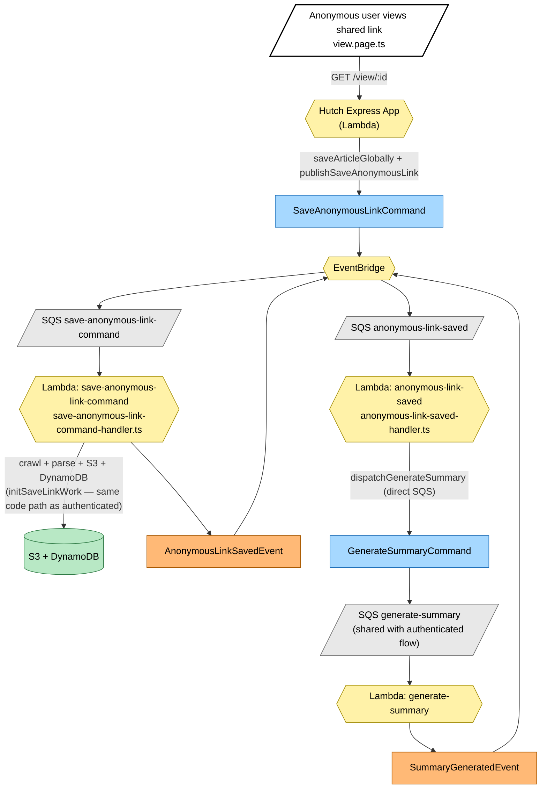

# Save-Link Event Storming

End-to-end map of what happens after the user submits a URL from the UI.
Convention: **Command (blue)** → **System (yellow)** → **Event (orange)** → next Command(s).
Read models / writes shown in green. SQS / DLQ topology shown grey.

Diagrams are pre-rendered as SVGs in `diagrams/` so they display in any Markdown viewer (MacDown, GitHub, browsers, Quicklook) without a Mermaid plugin. The original Mermaid source is kept below each image so the diagram can be re-rendered with `npx -p @mermaid-js/mermaid-cli mmdc -i SAVE_LINK_EVENT_STORMING.md -o diagrams/save-link.svg`.

---

## Legend

Mermaid source

---

## End-to-End Flow (authenticated `/queue` save)

Mermaid source

---

## Anonymous variant (`/view/:id` save by anonymous visitor)

Reuses the same backend summary path; differs only in the entry command and the dedicated worker queue.

Mermaid source

---

## Command → System → Event(s) Reference Table

| # | Command | System (handler) | Event(s) emitted | Triggers next command(s) |
|---|---|---|---|---|
| 1 | `SaveArticle` (HTTP `POST /queue`, `POST /queue/save`) | Hutch Express App on Lambda — `queue.page.ts:182` & `:211` | `ArticleMetadataSaved` (in-process; HTTP 201/303 returned) | `SaveLinkCommand`, `UpdateFetchTimestampCommand`, optionally `RefreshArticleContentCommand` |
| 2 | `RefreshArticleContentCommand` (EventBridge → SQS `refresh-article-content`) | `refresh-article-content.main.ts` Lambda | — (terminal; DynamoDB UpdateItem) | none |
| 3 | `UpdateFetchTimestampCommand` (EventBridge → SQS `update-fetch-timestamp`) | `update-fetch-timestamp.main.ts` Lambda | — (terminal; DynamoDB UpdateItem) | none |
| 4 | `SaveLinkCommand` (EventBridge → SQS `save-link-command`) | `save-link-command.main.ts` Lambda — `save-link-command-handler.ts` | `LinkSavedEvent` (after S3 + DynamoDB writes) | (via reaction) `GenerateSummaryCommand` |
| 5 | `LinkSavedEvent` reaction (EventBridge → SQS `link-saved`) | `link-saved.main.ts` Lambda — `link-saved-handler.ts` | — | `GenerateSummaryCommand` (dispatched directly to SQS, **not** via EventBridge) |
| 6 | `GenerateSummaryCommand` (direct SQS `generate-summary`) | `generate-summary.main.ts` Lambda — `generate-summary-handler.ts` | `SummaryGeneratedEvent` | none |
| 7 | `SummaryGeneratedEvent` reaction (EventBridge → SQS `summary-generated`) | `summary-generated.main.ts` Lambda | — (logger only) | none |
| A1 | `SaveAnonymousLinkCommand` (anonymous `/view` save) | `save-anonymous-link-command.main.ts` Lambda | `AnonymousLinkSavedEvent` | (via reaction) `GenerateSummaryCommand` |
| A2 | `AnonymousLinkSavedEvent` reaction (EventBridge → SQS `anonymous-link-saved`) | `anonymous-link-saved.main.ts` Lambda | — | `GenerateSummaryCommand` (joins shared queue) |

---

## Topology notes

- **Command vs. Event naming.** `SaveLinkCommand` and `SaveAnonymousLinkCommand` are intent (imperative). `LinkSavedEvent`, `AnonymousLinkSavedEvent`, `SummaryGeneratedEvent` are facts (past tense). Definitions live in `src/packages/hutch-infra-components/src/events.ts`.
- **Two transport patterns.** Most cross-Lambda hops go through **EventBridge → SQS** via `HutchEventBus.subscribe(...)` (`event-bus.ts:60`). The single exception is `GenerateSummaryCommand`, which both `link-saved` and `anonymous-link-saved` Lambdas dispatch **directly to the SQS queue** via `initSqsCommandDispatcher` — this is a one-to-one command dispatch, not a fan-out event.
- **Every SQS-backed Lambda has a DLQ + SNS email alarm** (`hutch-sqs-backed-lambda.ts:44-68`) — the alert email is shared (`alertEmail` config) and pages on any DLQ message visible for 5 min.
- **Visibility timeouts:** all SQS queues use `60s`, except `generate-summary` (`300s`) — the Deepseek call is the long pole and the Lambda timeout is `45s`, leaving headroom for SQS redelivery.
- **Synchronous side of the request.** Before the HTTP response returns, the Hutch Lambda already writes article metadata to DynamoDB (so the user sees the article in their queue immediately). The crawl, S3 upload, and summary all happen async on the worker chain.
- **Idempotency.** `saveLinkWork` (shared by authenticated + anonymous handlers) is idempotent on the URL — re-processing a `SaveLinkCommand` overwrites the same S3 key (derived from `ArticleResourceUniqueId`) and re-writes the same DynamoDB attributes. Summary generation short-circuits via the `DynamoDbSummaryCache`.
