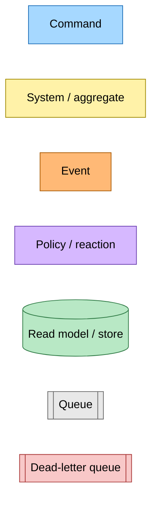
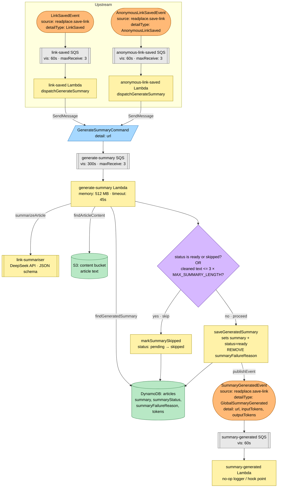
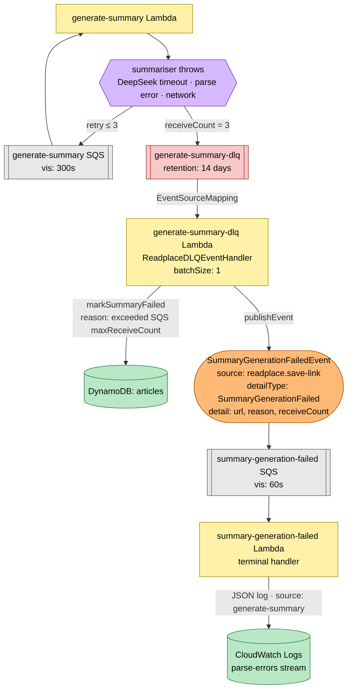
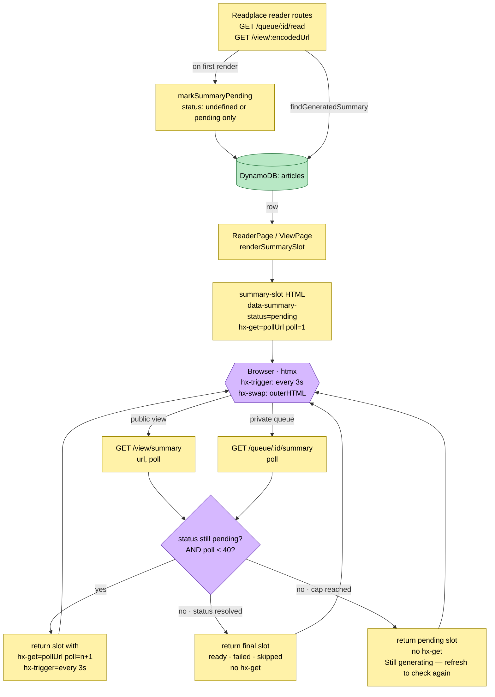

# Summary Generation Pipeline — Event Storming

**Commit:** `52017f3` · **Branch:** `main` · **Commit date:** 2026-04-20 · **Snapshot generated:** 2026-04-20

> Historical artefact. File paths in this document were accurate at the captured commit. Verify current paths against the working tree before acting.

---

## Scope

The pipeline covers: a saved link → the summariser Lambda → the generated-summary row in DynamoDB → the reader's UI (queue and public view), including the polling protocol while the summary is pending and the DLQ path when generation fails repeatedly.

Entry points traced:

- Upstream command producer: `LinkSavedEvent` → `link-saved` Lambda (dispatches `GenerateSummaryCommand`). File: `projects/save-link/src/save-link/link-saved-handler.ts`.
- Generator: `projects/save-link/src/generate-summary/generate-summary-handler.ts`.
- DLQ consumer: `projects/save-link/src/generate-summary/generate-summary-dlq-handler.ts`.
- Terminal failure handler: `projects/save-link/src/generate-summary/summary-generation-failed-handler.ts`.
- Reader UI polling routes: `GET /view/summary` and `GET /queue/:id/summary` in `projects/readplace/src/runtime/web/pages/`.

---

## Legend

Mermaid source

---

## End-to-end happy path (success + skip)

Mermaid source

### Notes

- **Why two upstream branches.** Authenticated saves emit `LinkSavedEvent`; anonymous views emit `AnonymousLinkSavedEvent`. Both dispatch the same `GenerateSummaryCommand`, so downstream processing is uniform — the summary is per-URL, not per-user.
- **Skip guard ordering.** `link-summariser` first shortcuts when the stored row is already `ready` or `skipped` (idempotent replay). Then it rejects content shorter than `3 × MAX_SUMMARY_LENGTH` cleaned characters, recording `status: skipped` so the UI can hide the slot instead of looping.
- **`GlobalSummaryGenerated` wire name.** Historical — retained to avoid redeploying subscribers. The TypeScript identifier is `SummaryGeneratedEvent`; the on-the-wire `detailType` is the immutable contract.
- **`summary-generated` consumer.** Currently a no-op sink that acknowledges the event. It exists as a subscription hook so future consumers (metrics, notifications) can attach without reshaping the producer.

---

## Failure path (retry → DLQ → terminal event)

Mermaid source

### Notes

- **Retry budget = 3.** `ReadplaceSqsQueue` defaults `dlqMaxReceiveCount = 3`. `generate-summary` does not override it, so a message exits to the DLQ on the third failed receive.
- **DLQ handler's two jobs.** (1) Flip the DynamoDB row from `pending` to `failed` with a recorded reason. (2) Emit a domain event so other subscribers can react. The Lambda is provisioned by the reusable `ReadplaceDLQEventHandler` component, which wires a one-at-a-time `EventSourceMapping`, grants `dynamodb:UpdateItem` and `events:PutEvents`, and requires no runtime knobs.
- **Terminal handler observability.** Writes a structured record to the shared `parse-errors` CloudWatch stream with `source: generate-summary`. A dashboard widget aggregates parse-errors across producers, so summary failures show up alongside content-parse failures without a dedicated metric.
- **`markSummaryFailed` guard.** The write uses `ConditionExpression: status IN (undefined, pending, failed)`. It will not clobber a `ready` or `skipped` row — important if a stale DLQ message arrives after a later successful retry (e.g. redrive via the console).

---

## UI polling (reader pages)

Mermaid source

### Notes

- **No side effects on the polling GET.** `GET /view/summary` and `GET /queue/:id/summary` call `findGeneratedSummary` only; `markSummaryPending` fires exclusively on page render of the reader/view (the POST-derived navigation), never inside the polling endpoint.
- **Poll cap = 40 × 3s = ~2 minutes.** After 40 polls with `status=pending`, the server returns a terminal pending slot without `hx-get` and a message inviting a manual refresh. This prevents a stuck DLQ from driving an indefinite XHR loop.
- **State machine in one place.** `summary-slot.component.ts` dispatches by `GeneratedSummary.status` to one of four leaf components (`summary-ready`, `summary-pending`, `summary-failed`, `summary-skipped`). Each owns its template; `summary-slot` owns no HTML.
- **Dual-context polling URL.** The public `/view/summary` includes the full encoded `url` query parameter (no auth required, URL is the sole key). The private `/queue/:id/summary` keys on the saved-article id and reads the URL server-side via the user's queue row.

---

## Command → System → Event(s) reference

| Command / Trigger | System | Event(s) emitted | Next command(s) |
|---|---|---|---|
| `SaveLinkCommand` (upstream, out of scope) | `save-link-command` Lambda | `LinkSavedEvent` | — (drives the pipeline in this snapshot) |
| `SaveAnonymousLinkCommand` (upstream, out of scope) | `save-anonymous-link-command` Lambda | `AnonymousLinkSavedEvent` | — (drives the pipeline in this snapshot) |
| `LinkSavedEvent` | `link-saved` Lambda | — | `GenerateSummaryCommand` (via SQS SendMessage) |
| `AnonymousLinkSavedEvent` | `anonymous-link-saved` Lambda | — | `GenerateSummaryCommand` (via SQS SendMessage) |
| `GenerateSummaryCommand` | `generate-summary` Lambda (via link-summariser + DeepSeek) | `SummaryGeneratedEvent` on success; none on skip (DB-only); none on throw (SQS retries) | — |
| `SummaryGeneratedEvent` | `summary-generated` Lambda | — | — (sink / hook point) |
| SQS retry exhaustion (3 receives) | `generate-summary-dlq` Lambda (`ReadplaceDLQEventHandler`) | `SummaryGenerationFailedEvent` | — |
| `SummaryGenerationFailedEvent` | `summary-generation-failed` Lambda | — (writes `parse-errors` log) | — |
| `GET /view/:encodedUrl` · `GET /queue/:id/read` | `view.page.ts` · `queue.page.ts` | — | Side effect on page render: `markSummaryPending` |
| `GET /view/summary?url=&poll=` · `GET /queue/:id/summary?poll=` | same | — | — (read-only; returns slot fragment; optionally re-arms hx-get for next poll) |

---

## Event contracts (wire format)

| Event | `source` | `detailType` | Detail schema |
|---|---|---|---|
| `LinkSavedEvent` | `readplace.save-link` | `LinkSaved` | `{ url: string, userId: string }` |
| `AnonymousLinkSavedEvent` | `readplace.save-link` | `AnonymousLinkSaved` | `{ url: string }` |
| `SummaryGeneratedEvent` | `readplace.save-link` | `GlobalSummaryGenerated` | `{ url: string, inputTokens: number, outputTokens: number }` |
| `SummaryGenerationFailedEvent` | `readplace.save-link` | `SummaryGenerationFailed` | `{ url: string, reason: string, receiveCount: number }` |
| `GenerateSummaryCommand` | — (command, no source/detailType — sent via SQS SendMessage) | — | `{ url: string }` |

> Wire names are deployment contracts. Renaming `source` or `detailType` requires coordinated redeploy of every publisher and subscriber.

---

## Persistence model

Single DynamoDB table `articles` carries the state machine; a generated summary is a set of fields on the article row:

| Attribute | Type | Written by |
|---|---|---|
| `summary` | string | `saveGeneratedSummary` (ready) |
| `summaryStatus` | `pending` \| `ready` \| `failed` \| `skipped` | all four mark/save operations |
| `summaryFailureReason` | string | `markSummaryFailed`; REMOVEd on successful `saveGeneratedSummary` |
| `summaryInputTokens` / `summaryOutputTokens` | number | `saveGeneratedSummary` |

Conditional writes (producer side, `projects/save-link/src/generate-summary/dynamodb-generated-summary.ts`) enforce the state-machine edges:

- `markSummaryPending`: only if status is absent or `!= ready`.
- `markSummaryFailed`: only if status is absent, `pending`, or `failed`.
- `markSummarySkipped`: only if status is absent or `pending`.
- `saveGeneratedSummary`: unconditional write + REMOVE `summaryFailureReason`.

The reader side (readplace, `projects/readplace/src/runtime/providers/article-summary/dynamodb-generated-summary.ts`) exposes `findGeneratedSummary` (returns the discriminated-union `GeneratedSummary`) and `markSummaryPending` (same guard as producer) — it never transitions the row into a terminal state.
