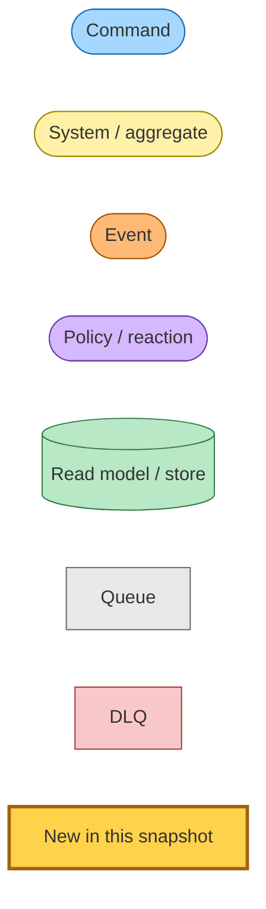

# User Data Export Flow

Snapshot pinned at commit [`56099f1`](../../) on branch `claude/fix-export-data-error-XkGXV` (2026-04-30) — *feat(hutch,@packages/hutch-infra-components): async user data export via Command -> Lambda -> Event*.

This snapshot documents the **first** decomposition of "Export My Data" into Command → System → Event(s). The previous shape was a synchronous `GET /export/download` route that paginated DynamoDB inside the API Gateway request (30s hard cap) and returned the JSON inline; the new shape is asynchronous and unbounded by API Gateway.

## Legend



Nodes highlighted with the **`new`** class (yellow border) are introduced in this snapshot. Everything else is pre-existing infrastructure that the new flow plugs into.

## End-to-end flow

```mermaid
flowchart TD
  classDef command fill:#a6d8ff,stroke:#1e6fb8;
  classDef system fill:#fff2a8,stroke:#a08a00;
  classDef event fill:#ffb976,stroke:#a85800;
  classDef store fill:#b8e8c5,stroke:#2f7a45;
  classDef queue fill:#e8e8e8,stroke:#666;
  classDef dlq fill:#f8c8c8,stroke:#a83434;
  classDef new fill:#ffd24c,stroke:#a0660b,stroke-width:3px;

  click_button["User clicks 'Email Me My Data' on /export"]
  post_start[/"POST /export/start (web Lambda)"/]:::system
  find_email[("findEmailByUserId<br/>(users table, userId-index GSI)")]:::store
  cmd([ExportUserDataCommand<br/>{userId, email, requestedAt}]):::command
  cmd:::new
  redirect[/"303 -> /export?status=preparing"/]:::system

  rule[(EventBridge rule:<br/>source=hutch.api,<br/>detailType=ExportUserDataCommand)]:::store
  rule:::new
  queue[/"export-user-data SQS queue<br/>(visibilityTimeout=900s)"/]:::queue
  queue:::new
  dlq[/"export-user-data DLQ<br/>+ CloudWatch alarm + SNS email"/]:::dlq
  dlq:::new

  worker["export-user-data Lambda<br/>(900s, 1024MB)"]:::system
  worker:::new

  query[("DynamoDB Query<br/>userArticles + articles<br/>(paginated, pageSize=500)")]:::store
  s3_put[("S3 PutObject<br/>hutch-user-exports-{stage}<br/>key=exports/{userId}/{timestamp}.json")]:::store
  s3_put:::new
  presign[("getSignedUrl(GetObject)<br/>expiresIn = 7 days")]:::store
  presign:::new
  resend[("Resend email<br/>'Your Readplace export is ready'<br/>(button -> presigned URL)")]:::store
  resend:::new

  exported([UserDataExportedEvent<br/>{userId, articleCount, s3Key, exportedAt}]):::event
  exported:::new

  lifecycle[("S3 lifecycle rule<br/>prefix=exports/<br/>expire after 7 days")]:::store
  lifecycle:::new

  click_button --> post_start
  post_start --> find_email
  post_start -- "publishEvent" --> cmd
  post_start --> redirect

  cmd --> rule
  rule --> queue
  queue -. "maxReceiveCount exhausted" .-> dlq
  queue --> worker

  worker --> query
  query --> worker
  worker --> s3_put
  s3_put --> presign
  presign --> resend
  worker -- "publishEvent" --> exported

  s3_put -. "object expires after TTL" .-> lifecycle
```

## Command → System → Event(s) reference table

| Command / Event | Wire format (`source` / `detailType`) | Handler | Reads / writes | Emits | Triggers |
|---|---|---|---|---|---|
| **`ExportUserDataCommand`** *(new)* | `hutch.api` / `ExportUserDataCommand` | export-user-data Lambda (HutchSQSBackedLambda fronted by SQS + DLQ) | Reads `userArticles` (`userId-savedAt-index` GSI) and `articles` table; writes `exports/{userId}/{timestamp}.json` to `hutch-user-exports-{stage}`; calls Resend to deliver the presigned URL | `UserDataExportedEvent` | none — terminal in this flow |
| **`UserDataExportedEvent`** *(new)* | `hutch.export-user-data` / `UserDataExported` | _(no consumer wired yet — declared for downstream telemetry / future audit)_ | — | — | — |
| **`UserDataExportFailedEvent`** *(declared, not emitted)* | `hutch.export-user-data` / `UserDataExportFailed` | _(no DLQ consumer yet — `HutchDLQEventHandler` is article-table-specific; CloudWatch alarm + SNS-email on the DLQ pages the operator instead)_ | — | — | — |

## Why this shape

- **API Gateway HTTP API caps integration timeouts at 30s.** The previous `/export/download` paginated DynamoDB inline and returned the full JSON in the same response — for accounts with thousands of saved articles, the request 504'd at the gateway. The web Lambda's job is now strictly synchronous (publish a command, redirect); the unbounded work runs in the worker Lambda with a 900s budget.
- **One TTL constant, two consumers.** `EXPORT_DOWNLOAD_TTL_DAYS` lives in `projects/hutch/src/runtime/web/pages/export/export-ttl.ts` and is imported by both the Pulumi infra (S3 `BucketLifecycleConfigurationV2.expiration.days`) and the runtime worker (`getSignedUrl(..., { expiresIn: ... })`). Bumping the number is a one-place change; the lifecycle and the link expire together.
- **Email is enriched at publish-time, not in the worker.** The web Lambda has the session userId but not the email. A new `findEmailByUserId` provider (DynamoDB `userId-index` GSI on the users table; in-memory `Map` lookup for tests) does a single Query and the result is carried in the command body. The worker never has to look the user up again — the command is self-contained.
- **No new DynamoDB writes.** Export is a read-only fan-out into S3; we don't track in-progress exports in DynamoDB. The S3 lifecycle handles cleanup, the DLQ alarm handles operator notification, and the Resend transactional email delivers the link without server-side state to poll.

## Rollout notes

- **Wire-format change.** `ExportUserDataCommand`, `UserDataExportedEvent`, and `UserDataExportFailedEvent` are new EventBridge `source` / `detailType` strings. They have no producers or consumers outside this PR, so no coordinated multi-stack deploy is required — the web Lambda starts publishing, the worker starts subscribing, and both ship together.
- **New S3 bucket.** `hutch-user-exports-{stage}` is provisioned by Pulumi and configured private (BucketPublicAccessBlock + presigned-URL-only access). The lifecycle rule is filtered to `prefix=exports/` so future siblings under the same bucket are unaffected.
- **External secret.** `RESEND_API_KEY` is reused from the existing web Lambda — no new GitHub Actions secret needed. The worker reads it via `requireEnv`, falling back to `getEnv` only during `pulumi.runtime.isDryRun()` so `pnpm check-infra` passes locally without the secret.
