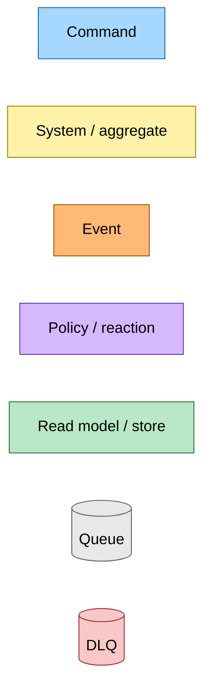
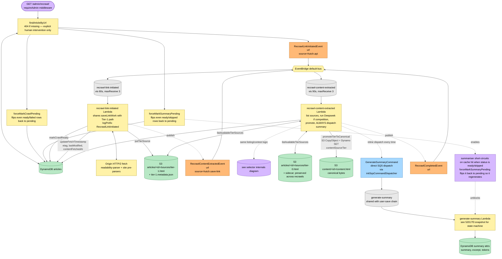
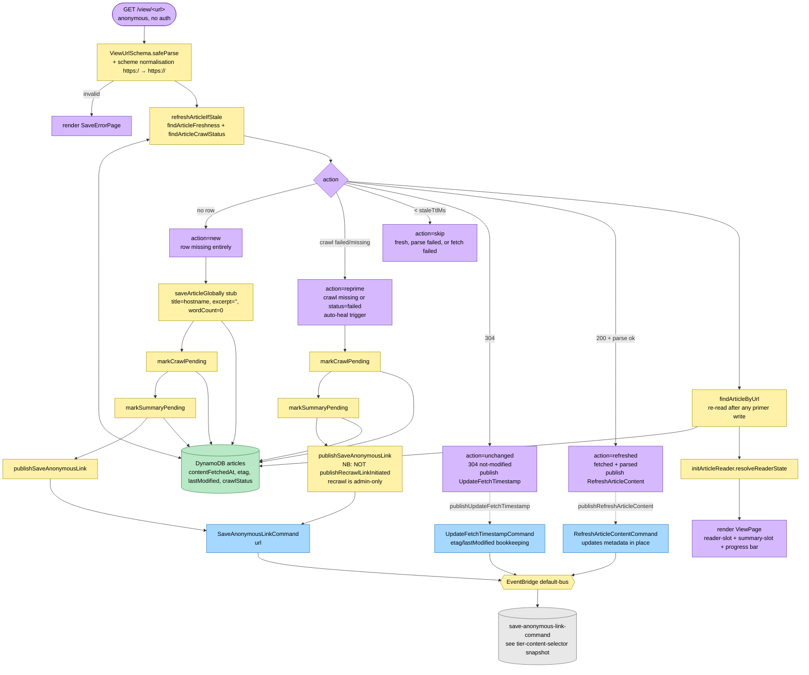
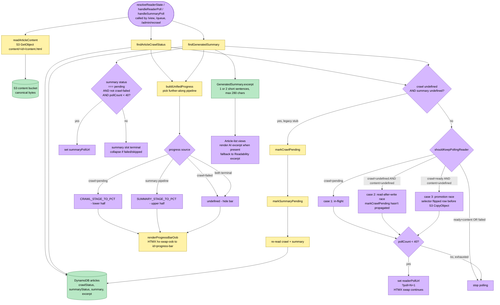
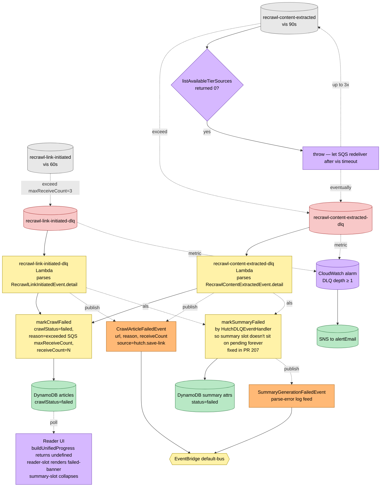

# Recrawl & Auto-Heal Flow — Event Storming

**Commit:** `98f2e47` &nbsp;•&nbsp; **Commit date:** 2026-05-01 &nbsp;•&nbsp; **Generated:** 2026-05-01 &nbsp;•&nbsp; **Branch:** `main`
**Subject:** `chore: bump firefox extension version to 1.0.82`

A point-in-time map of the **post-tier-selector recrawl + auto-heal pipeline**. The previous snapshot ([`a6949fd`](../2026-04-28-a6949fd/tier-content-selector-flow.md)) captured the new tier-content selector but described admin recrawl as "unchanged at the entry-point layer — the existing `SaveAnonymousLinkCommand` path now writes a fresh `sources/tier-1.html`." That note is now obsolete: a dedicated **recrawl** event chain exists.

What is new in this snapshot:

- A purpose-built **`RecrawlLinkInitiatedEvent` → `RecrawlContentExtractedEvent` → `RecrawlCompletedEvent`** chain replaces the prior reuse of `SaveAnonymousLinkCommand` for admin-triggered re-fetch. Two new Lambdas back it: `recrawl-link-initiated` (re-runs the save-link work — crawl, parse, media rewrite, `markCrawlReady`, write `sources/tier-1.html` + sidecar) and `recrawl-content-extracted` (a near-clone of `select-most-complete-content` that **always** dispatches `GenerateSummaryCommand` regardless of whether canonical changed). Each has its own SQS queue + DLQ handler; both DLQ paths flip `crawlStatus=failed` and emit `CrawlArticleFailedEvent`.
- The reason for the new chain: recrawl is the operator opting out of the canonical-change dedup gate so the AI excerpt is regenerated every time. The user-save selector still gates `LinkSaved` / `AnonymousLinkSaved` on canonical change to keep the summary pipeline idempotent on losses; the recrawl selector skips the gate by design.
- The `/admin/recrawl/<url>` route force-flips both `crawlStatus` and the summary row to `pending` (via `forceMarkCrawlPending` / `forceMarkSummaryPending` — overrides on top of the regular state machine) before publishing `RecrawlLinkInitiatedEvent`. This way the reader UI shows the "recrawl in progress" skeleton immediately and the summariser short-circuit on the cached `ready` row is bypassed.
- The article reader (`/view/<url>`, `/queue`, `/admin/recrawl/<url>` polls) now contains two healing branches that did not exist in past snapshots: (1) **legacy-stub healing** in `resolveReaderState` re-primes both pipelines when the article row exists but carries no `crawlStatus` and no summary state attribute (rows from before the state machines); (2) **promotion-race polling** keeps the reader-slot polling open when `crawlStatus="ready"` but `readArticleContent` still returns `undefined` — the selector flipped the row before the S3 `CopyObject` for canonical landed.
- Anonymous `/view/<url>` carries its own auto-heal at the **freshness layer**, distinct from the recrawl chain. `refreshArticleIfStale` returns `"reprime"` when the row exists with `crawlStatus="failed"`, which `view.page.ts` handles by calling `markCrawlPending` + `markSummaryPending` and re-publishing `SaveAnonymousLinkCommand`. This path **does not** publish `RecrawlLinkInitiatedEvent` — recrawl is admin-only; the anonymous heal reuses the regular save-anonymous worker.
- The summary pipeline now produces a **second output alongside the summary**: a one-or-two-sentence `excerpt`. Both come from a single Deepseek call with a `json_schema` output config, are written together by `saveGeneratedSummary`, and carry the `excerpt` as an optional field on the `GeneratedSummary` read model. Article-list views render the AI excerpt in place of the original Readability excerpt when present.
- The reader page renders a unified single-bar **progress indicator** (`progress-bar.component`) driven by `buildUnifiedProgress` in the article-reader core. It picks whichever pipeline (crawl or summary) is further along, maps that pipeline's `stage` attribute to a percentage on the 0–100 scale, and short-circuits to "no animation" when the crawl has failed or both pipelines have reached terminal states. The bar is updated out-of-band on each reader/summary poll via `renderProgressBarOob`.

> Snapshots are historical. Any file path referenced below may be renamed, moved, or deleted in the future. Treat as an artefact, not a live guide.

---

## Legend

Mermaid source

---

## Admin recrawl flow — `/admin/recrawl/<url>` to fresh excerpt

The admin recrawl entry point is the **only** publisher of `RecrawlLinkInitiatedEvent`. The route force-flips both pipelines back to `pending`, publishes the recrawl event, then renders the reader skeleton. The downstream Lambdas re-fetch from origin, re-run the tier selector against the fresh sources, and dispatch `GenerateSummaryCommand` unconditionally so a fresh summary + excerpt always lands.

Mermaid source

---

## Anonymous /view auto-heal — distinct path, reuses save-anonymous chain

Anonymous viewers hitting `/view/<url>` get their own auto-heal path that **does not** publish `RecrawlLinkInitiatedEvent`. The freshness layer reads the article row + crawl status and returns one of `new` / `reprime` / `skip` / `unchanged` / `refreshed`. The `reprime` action is the auto-heal: it fires when the article row exists but `crawlStatus="failed"` (or the crawl row is missing), and it re-uses the regular `SaveAnonymousLinkCommand` worker — no recrawl event needed because the worker already does the right thing for first-visit and re-prime cases (writes a fresh `sources/tier-1.html` and lets the user-save selector decide).

Mermaid source

---

## Reader resolution — legacy-stub heal + promotion-race polling + unified progress

The article reader is shared between `/view/<url>` (anonymous), `/queue` (authenticated list), and `/admin/recrawl/<url>` (admin operator). It is responsible for three independent concerns: (1) deciding whether to keep polling the reader-slot, (2) healing pre-state-machine "legacy stub" rows, and (3) computing the unified progress tick that is sent out-of-band to the page-level progress bar.

Mermaid source

---

## Failure paths — recrawl DLQs converge on the same `CrawlArticleFailedEvent`

Both new recrawl Lambdas have their own DLQs. After `maxReceiveCount=3` exhaustions on either queue, a `HutchDLQEventHandler` Lambda parses the original event body, flips `crawlStatus=failed` with `reason="exceeded SQS maxReceiveCount"`, and publishes the same terminal `CrawlArticleFailedEvent` that the user-save chain DLQs publish. The DLQ-arrival CloudWatch alarms wired by `HutchSQSBackedLambda` page `alertEmail` via SNS the moment a message lands in either DLQ.

The `recrawl-content-extracted` handler also has an in-band retry: if `listAvailableTierSources` returns zero (an S3-list-vs-event-delivery race), the Lambda throws so SQS redelivers after the visibility timeout. Convergence is the same as the user-save selector's race — usually fixed on the second attempt; only after `maxReceiveCount` does the message land in the DLQ.

Mermaid source

---

## Command → System → Event(s) reference

| Command / Event | Handler / system | Emits / writes | Triggers next |
|---|---|---|---|
| `GET /admin/recrawl/<url>` (HTTP) | Express `handleRecrawlArticle` (`projects/hutch`) | `forceMarkCrawlPending` + `forceMarkSummaryPending` (DynamoDB), publishes `RecrawlLinkInitiatedEvent` | `recrawl-link-initiated` Lambda |
| `RecrawlLinkInitiatedEvent` | `recrawl-link-initiated` Lambda | Re-runs `saveLinkWork` (HTTP/2 fetch + Readability + media rewrite); writes `sources/tier-1.html` + sidecar; `markCrawlReady`; `updateFetchTimestamp` | publishes `RecrawlContentExtractedEvent` |
| `RecrawlContentExtractedEvent` | `recrawl-content-extracted` Lambda | `listAvailableTierSources`; runs Deepseek selector if competition, short-circuits on a single tier; `promoteTierToCanonical` (S3 CopyObject + Dynamo SET `contentSourceTier`); **always** dispatches `GenerateSummaryCommand` | `generate-summary` Lambda; publishes `RecrawlCompletedEvent` |
| `RecrawlCompletedEvent` | (no subscribers at this commit) | Used as a hook for future operator notifications | — |
| `GET /view/<url>` (HTTP) | Express `handleViewArticle` (`projects/hutch`) | `refreshArticleIfStale` decides; `new`/`reprime` writes stub + `markCrawlPending` + `markSummaryPending` and publishes `SaveAnonymousLinkCommand` | `save-anonymous-link-command` Lambda (see `bfd85c7` snapshot) |
| `refreshArticleIfStale` action `refreshed` | Same in-process call | Publishes `RefreshArticleContentCommand` (in-place metadata update) | `refresh-article-content` Lambda |
| `refreshArticleIfStale` action `unchanged` | Same in-process call | Publishes `UpdateFetchTimestampCommand` | `update-fetch-timestamp` Lambda |
| `resolveReaderState` (per request) | `article-reader` core | Legacy-stub heal: `markCrawlPending` + `markSummaryPending` when both undefined; computes `readerPollUrl`, `summaryPollUrl`, unified `ProgressTick` | Reader/summary HTMX polls (`/view/reader`, `/view/summary`, admin equivalents) |
| `handleReaderPoll` / `handleSummaryPoll` | `article-reader` core | Re-reads crawl + summary + content; emits OOB progress-bar fragment via `renderProgressBarOob`; bounds polling at `MAX_POLLS=40` | Continues HTMX swap loop or terminates |
| `GenerateSummaryCommand` | `generate-summary` Lambda | Single Deepseek `json_schema` call returns `{summary, excerpt}`; `saveGeneratedSummary` writes both atomically; emits `SummaryGeneratedEvent` on success | `summary-generated` Lambda (see `52017f3` snapshot) |
| `recrawl-link-initiated-dlq` | `HutchDLQEventHandler` | `markCrawlFailed`; publishes `CrawlArticleFailedEvent`; CloudWatch alarm pages `alertEmail` | (terminal) |
| `recrawl-content-extracted-dlq` | `HutchDLQEventHandler` | `markCrawlFailed`; publishes `CrawlArticleFailedEvent`; CloudWatch alarm pages `alertEmail` | (terminal) |

---

## Why the recrawl event chain is separate from `SaveAnonymousLinkCommand`

The previous snapshot's note that admin recrawl reused `SaveAnonymousLinkCommand` is no longer true; the user-save selector gates `LinkSaved` / `AnonymousLinkSaved` on canonical change to keep the summary pipeline idempotent on losses (a re-save of the same URL whose tier didn't change must not regenerate the summary, since the user-facing semantics of "save" is dedup-friendly). For admin recrawl the operator-facing semantics is the opposite: the human pressed the button **because** they want a fresh AI excerpt regardless of whether the source bytes changed. Splitting the event chain keeps both invariants enforceable in the handler code (`select-most-complete-content-handler` checks `currentTier !== winnerTier`; `recrawl-content-extracted-handler` skips the check) without conditional branching that would couple the two semantics together.

The view-side auto-heal (`reprime` action) is not affected by this split — it represents an **anonymous viewer arriving at a previously-failed save**, which from a user-save semantics standpoint is the same as a fresh save (we want to retry, and we want the summary to land if it didn't before). It correctly stays on the `SaveAnonymousLinkCommand` chain.
