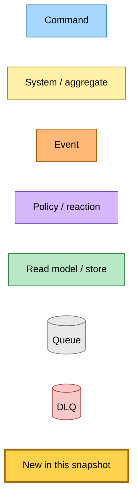

# Entry-Point Redesign on the Typed Aggregate — Event Storming

**Commit:** `7873556` &nbsp;•&nbsp; **Commit date:** 2026-05-13 &nbsp;•&nbsp; **Generated:** 2026-05-13 &nbsp;•&nbsp; **Branch:** `claude/redesign-aggregate-entry-point-jy6GE`
**Subject:** `feat(@packages/domain,@packages/hutch-infra-components,save-link): add submitLink/requestRecrawl transitions and SubmitLinkCommand`

> Mermaid sources only — SVG render skipped (sandboxed Chromium unavailable in this environment).

A point-in-time map of the **entry-point flows** (save, anonymous /view, extension upload, admin recrawl) after the typed aggregate took over as the substrate. The previous snapshot ([`1c1095ca`](../2026-05-13-1c1095ca/refresh-and-auto-heal-flow.md)) described the refresh tier-selection and auto-heal mechanism. This snapshot documents the foundation for the entry-point redesign: the new transitions, command, and dispatcher case that hutch and save-link will route through.

What is new in this snapshot:

- **`submitLink` (upsert transition)** — runs on first save (synthesises a hostname-only pending stub so the queue card renders immediately) and on every subsequent save (idempotent no-op on the row, always re-dispatches the `SubmitLinkCommand`). The transition is the single substrate hutch will route every entry point through (`/queue` save, `/view/<url>` anonymous save, extension upload).
- **`requestRecrawl` (operator recovery transition)** — sets `freshness.contentFetchedAt = epoch` so the next stale-check treats the row as expired, resets crawl + summary axes to pending, and clears `summaryAutoHeal` so a previously-exhausted summary gets full retry budget. The standard refresh path then runs — no parallel recrawl-completed pipeline.
- **`SubmitLinkCommand`** — new EventBridge command with `{ url, userId?, rawHtml? }` detail. Becomes the unified entry-point command. The legacy `SaveLinkCommand` / `SaveAnonymousLinkCommand` / `SaveLinkRawHtmlCommand` triple still exists for the previous handlers; the new command is the path the migrated hutch callers will dispatch.
- **`dispatch-submit-link` effect** — the aggregate's effect type gains a variant for entry-point dispatches; the `lambda-effect-dispatcher` forwards it to the new SQS dispatcher; the dep-bundle wires `dispatchSubmitLink` next to `dispatchGenerateSummary`.
- **`upsertAndPersist` orchestrator** — `initTransitionAndPersist` now returns both `transitionAndPersist` (asserts the row exists — regular mutations) and `upsertAndPersist` (allows undefined — entry-point upserts). Both skip the DDB write when the transition's `writes` array is empty so `submitLink` can idempotent no-op the row while still re-dispatching its effect.

> Snapshots are historical. Any file path referenced below may be renamed, moved, or deleted in the future. Treat as an artefact, not a live guide.

---

## Legend

<details><summary>Mermaid source</summary>



</details>

---

## Submit-link flow — the unified entry-point

When hutch's `/queue` POST, `/view/<url>` GET, or the extension's `/queue/save-html` POST receives a request, it calls `upsertAndPersist(submitLink, ...)`. The aggregate's `submitLink` transition synthesises a stub on first save (or no-ops on a re-save), then dispatches `SubmitLinkCommand` via SQS. The save-link Lambda — fed by the same command on either the URL-fetch branch or the raw-HTML branch — performs the crawl/parse work, writes a tier source, and emits `TierContentExtractedEvent` to drive the standard tier selector.

<details><summary>Mermaid source</summary>

```mermaid
flowchart TD
    classDef command fill:#a6d8ff,stroke:#1e6fb8,color:#000
    classDef system  fill:#fff2a8,stroke:#a08a00,color:#000
    classDef event   fill:#ffb976,stroke:#a85800,color:#000
    classDef policy  fill:#d6b8ff,stroke:#6b3fb0,color:#000
    classDef store   fill:#b8e8c5,stroke:#2f7a45,color:#000
    classDef queue   fill:#e8e8e8,stroke:#666,color:#000
    classDef dlq     fill:#f8c8c8,stroke:#a83434,color:#000
    classDef new     fill:#ffd24c,stroke:#a0660b,stroke-width:3px,color:#000

    %% Entry points
    Save[POST /queue<br/>authenticated save]:::system
    View[GET /view/&lt;url&gt;<br/>anonymous read]:::system
    Ext[POST /queue/save-html<br/>extension rawHtml upload]:::system
    Admin[POST /admin/recrawl/&lt;url&gt;<br/>operator recovery]:::system

    %% Aggregate transitions
    Submit[submitLink transition<br/>upsert: stub on first save<br/>no-op + redispatch on rest]:::new
    Recrawl[requestRecrawl transition<br/>contentFetchedAt=epoch<br/>resets crawl+summary+autoheal]:::new

    Save -- upsertAndPersist --> Submit
    View -- upsertAndPersist --> Submit
    Ext -- upsertAndPersist --> Submit
    Admin -- transitionAndPersist --> Recrawl

    %% DDB row
    DDB[(DynamoDB articles<br/>crawl/summary axes,<br/>freshness, autoHeal)]:::store
    Submit -. save .-> DDB
    Recrawl -. save .-> DDB

    %% Effect dispatch
    EffDisp[lambda-effect-dispatcher<br/>case dispatch-submit-link]:::new
    Submit -. dispatch-submit-link effect .-> EffDisp
    Recrawl -. dispatch-submit-link effect .-> EffDisp

    %% Command
    SLC[SubmitLinkCommand<br/>{ url, userId?, rawHtml? }]:::new
    EffDisp -- SQS send --> SLC

    %% Bus + downstream
    Bus{{EventBridge default-bus}}:::system
    SLC --> Bus
    QSL[(submit-link queue<br/>future: in commit 4)]:::queue
    Bus --> QSL

    SLHandler[submit-link handler<br/>future: in commit 4]:::policy
    QSL --> SLHandler

    %% Outputs
    Origin[Origin HTTP fetch<br/>+ readability parse]:::system
    SLHandler <--> Origin
    TierS3[(S3 articles/&lt;id&gt;/sources/tier-N.html)]:::store
    SLHandler -. putTierSource .-> TierS3

    TCE[TierContentExtractedEvent<br/>downstream selector trigger]:::event
    SLHandler -.publish.-> TCE
    TCE --> Bus
```

</details>

---

## Operator recrawl flow — recovery via setTTLToPast

`requestRecrawl` is the operator's only recovery affordance. It flips a healthy article's row back to pending by setting `freshness.contentFetchedAt = new Date(0).toISOString()`, then dispatches a `SubmitLinkCommand` to re-trigger the standard pipeline. The standard stale-check + refresh path runs identically; the row settles back to `ready` with new metadata. No parallel recrawl-specific events.

<details><summary>Mermaid source</summary>

```mermaid
flowchart TD
    classDef command fill:#a6d8ff,stroke:#1e6fb8,color:#000
    classDef system  fill:#fff2a8,stroke:#a08a00,color:#000
    classDef event   fill:#ffb976,stroke:#a85800,color:#000
    classDef policy  fill:#d6b8ff,stroke:#6b3fb0,color:#000
    classDef store   fill:#b8e8c5,stroke:#2f7a45,color:#000
    classDef queue   fill:#e8e8e8,stroke:#666,color:#000
    classDef new     fill:#ffd24c,stroke:#a0660b,stroke-width:3px,color:#000

    Admin[POST /admin/recrawl/&lt;url&gt;<br/>operator action]:::system
    Recrawl[requestRecrawl transition<br/>contentFetchedAt=epoch<br/>crawl→pending<br/>summary→pending<br/>summaryAutoHeal={attempts:0}]:::new

    Admin -- transitionAndPersist --> Recrawl

    DDB[(DynamoDB articles row<br/>freshness.contentFetchedAt = 1970-01-01)]:::store
    Recrawl -. save .-> DDB

    SLC[SubmitLinkCommand<br/>{ url } no userId/rawHtml<br/>= operator initiated]:::new
    Recrawl -. dispatch-submit-link effect .-> SLC

    %% Standard pipeline downstream
    Bus{{EventBridge default-bus}}:::system
    SLC --> Bus
    SLH[submit-link handler<br/>= same as user save]:::policy
    Bus --> SLH

    TCE[TierContentExtractedEvent<br/>standard selector trigger]:::event
    SLH -.publish.-> TCE

    %% Eventually
    Final[(Row transitions back to ready,<br/>summary regenerates,<br/>autoHeal budget restored)]:::store
    TCE -.eventual.-> Final
```

</details>

---

## Submit transition state — pending stub vs idempotent no-op vs re-dispatch

`submitLink` is an upsert: it has three runtime branches depending on the loaded row state. The transition's `writes` array is empty on idempotent paths so the orchestrator skips the DDB write while still dispatching the SQS message — that re-triggers a stuck pending row without churning the freshness timestamp.

<details><summary>Mermaid source</summary>

```mermaid
flowchart TD
    classDef command fill:#a6d8ff,stroke:#1e6fb8,color:#000
    classDef system  fill:#fff2a8,stroke:#a08a00,color:#000
    classDef event   fill:#ffb976,stroke:#a85800,color:#000
    classDef policy  fill:#d6b8ff,stroke:#6b3fb0,color:#000
    classDef store   fill:#b8e8c5,stroke:#2f7a45,color:#000
    classDef new     fill:#ffd24c,stroke:#a0660b,stroke-width:3px,color:#000

    Entry[upsertAndPersist submitLink]:::new
    Load{load article}:::policy
    Entry --> Load

    None[article === undefined<br/>first save]:::policy
    Pending[crawl.kind === 'pending'<br/>in-flight]:::policy
    Term[crawl.kind in ready/failed/unsupported<br/>terminal]:::policy

    Load -- undefined --> None
    Load -- pending --> Pending
    Load -- terminal --> Term

    Stub[Synthesise hostname stub<br/>title='Article from {host}'<br/>crawl/summary=pending<br/>writes=metadata,freshness,crawl,summary]:::new
    NoOp1[article unchanged<br/>writes=[]<br/>save skipped]:::policy
    NoOp2[article unchanged<br/>writes=[]<br/>save skipped<br/>operator must use requestRecrawl to flip]:::policy

    None --> Stub
    Pending --> NoOp1
    Term --> NoOp2

    Effect[dispatch-submit-link effect]:::new
    Stub --> Effect
    NoOp1 --> Effect
    NoOp2 --> Effect

    SLC[SubmitLinkCommand → SQS]:::command
    Effect --> SLC
```

</details>

---

## Command → System → Event(s) reference

The events and commands published or consumed in this snapshot's flows:

| Command / Event | System that handles it | Emits | Triggers next |
|---|---|---|---|
| `submitLink` (transition) | `upsertAndPersist` orchestrator | `dispatch-submit-link` effect | `SubmitLinkCommand` via SQS |
| `requestRecrawl` (transition) | `transitionAndPersist` orchestrator | `dispatch-submit-link` effect | `SubmitLinkCommand` via SQS |
| `SubmitLinkCommand` | save-link `submit-link` handler (future: commit 4) | `TierContentExtractedEvent` | tier selector pipeline |
| `dispatch-submit-link` effect | `lambda-effect-dispatcher` (this snapshot's new case) | `SubmitLinkCommand` SQS message | save-link handler |

---

## Out of scope (deferred)

The brief's seven-commit plan deliberately keeps the following for follow-up commits in the same PR or in subsequent work:

- **Commit 2: hutch caller migrations.** `markCrawlPending` / `forceMarkCrawlPending` / `forceMarkSummaryPending` in `save-article-from-url.ts`, `view.page.ts`, `admin/recrawl.page.ts` still call the inline writers; they will be migrated to `upsertAndPersist(submitLink, …)` and `transitionAndPersist(requestRecrawl, …)`.
- **Commit 3: delete the recrawl pipeline.** `RecrawlLinkInitiatedEvent`, `RecrawlContentExtractedEvent`, `RecrawlCompletedEvent` and their four Lambdas + DLQs remain wired. They will be deleted once the hutch caller migration above is in.
- **Commit 4: collapse the save-link entry-point handlers.** `save-link-command-handler`, `save-anonymous-link-command-handler`, and `save-link-raw-html-command-handler` will collapse into `submit-link-handler` (URL-fetch branch) and `submit-link-content-handler` (raw-HTML branch). Both Lambdas will subscribe to `SubmitLinkCommand` with EventBridge filtering on `rawHtml`.
- **Commit 5: delete the markX/forceMark writer functions** in hutch's `article-crawl` / `article-summary` provider trees once every caller is migrated.
- **Commit 6: cacheable read wrapper** for GET `/view/<url>` and `/queue/:id/read` returning 304 on `If-None-Match` match against a strong ETag derived from `(crawl.kind, summary.kind, freshness.contentFetchedAt)`.
