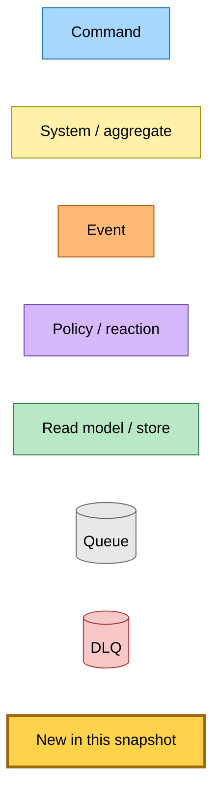

# Entry-Point Redesign Foundation — Event Storming

**Base commit:** `a8c3a85` &nbsp;•&nbsp; **Commit date:** 2026-05-13 &nbsp;•&nbsp; **Generated:** 2026-05-13 &nbsp;•&nbsp; **Branch:** `claude/redesign-entry-point-flznu`
**Subject:** `refactor(@packages/domain,@packages/hutch-infra-components,save-link): entry-point redesign foundation (EventBridge route, deploy-safe)`

A point-in-time map of the new entry-point foundation: the two aggregate transitions (`submitLink`, `requestRecrawl`), the new wire-format command (`SubmitLinkCommand`), and the `dispatch-submit-link` effect that publishes the command via EventBridge.

The previous attempt at this foundation (PR #303, commit `9e80053`, reverted by `a8c3a85`) routed `dispatchSubmitLink` through a direct SQS dispatcher that required `SUBMIT_LINK_QUEUE_URL` at module init. The corresponding SQS queue and Lambda environment block were never wired in infra, so every save-link Lambda crashed at module init on staging. This snapshot documents the corrected route: publish `SubmitLinkCommand` via EventBridge using the existing `EVENT_BUS_NAME` env var that every Lambda already has wired.

What is new in this snapshot:

- **`submitLink` transition** — upsert transition that synthesises a hostname-only pending stub on first save (so the queue card renders at t=0 before the crawler runs) and leaves any existing row untouched on a subsequent save. Always emits `dispatch-submit-link` so a stuck pending or post-recrawl row gets re-triggered.
- **`requestRecrawl` transition** — operator recovery transition that sets `freshness.contentFetchedAt` to the epoch (so the next stale-check treats the row as expired), resets both axes to `pending`, clears `summaryAutoHeal`, and emits `dispatch-submit-link`. Not idempotent by design — the operator is asking for a re-run.
- **`SubmitLinkCommand`** — new EventBridge command (`source: "hutch.api"`, `detailType: "SubmitLinkCommand"`, detail: `{ url, userId?, rawHtml? }`). Becomes the unified entry-point command for the redesigned save flow. The future submit-link subscriber Lambda branches on the optional `rawHtml` (tier-0 path vs URL-fetch path) and `userId` (authenticated save vs anonymous /view).
- **`dispatch-submit-link` effect** — new variant on the `Effect` union; the lambda-effect-dispatcher's case publishes `SubmitLinkCommand` to EventBridge using the existing `publishEvent`. No new SQS queue, no new env var.
- **`upsertAndPersist` orchestrator** — extension to `initTransitionAndPersist` that allows `article: Article | undefined` on the transition input and skips the DDB save when the transition declares an empty `writes` scope. This is what `submitLink` needs: synthesise on first save, no-op write on subsequent save, dispatch the effect every time.

Nothing in this PR has a runtime caller; the new transitions, command, and effect handler sit dormant until the hutch caller migration lands in a follow-up PR. The downstream subscriber Lambda (`submit-link`) lands later still — see the "Deferred" section below for the safe sequencing.

> Snapshots are historical. Any file path referenced below may be renamed, moved, or deleted in the future. Treat as an artefact, not a live guide.

---

## Legend



---

## What this PR ships — transitions emit `dispatch-submit-link`; dispatcher publishes `SubmitLinkCommand` via EventBridge

The aggregate exposes two new entry-point transitions. The operator/user-facing caller is deferred to a follow-up PR — neither transition has a runtime caller in this PR. The transitions return an in-process `dispatch-submit-link` effect; the lambda-effect-dispatcher's new case translates that effect into an EventBridge `publishEvent` call using the existing `EVENT_BUS_NAME`. No SQS queue, env var, or IAM grant is required at the publisher.

```mermaid
flowchart TD
    classDef command fill:#a6d8ff,stroke:#1e6fb8,color:#000
    classDef system  fill:#fff2a8,stroke:#a08a00,color:#000
    classDef event   fill:#ffb976,stroke:#a85800,color:#000
    classDef policy  fill:#d6b8ff,stroke:#6b3fb0,color:#000
    classDef store   fill:#b8e8c5,stroke:#2f7a45,color:#000
    classDef queue   fill:#e8e8e8,stroke:#666,color:#000
    classDef new     fill:#ffd24c,stroke:#a0660b,stroke-width:3px,color:#000

    %% Aggregate (in-process)
    Agg[Article aggregate<br/>initTransitionAndPersist<br/>+ upsertAndPersist]:::new

    %% Transitions
    SubLink[submitLink transition<br/>upsert: synthesise stub on first save,<br/>no-op writes on subsequent save]:::new
    ReqRec[requestRecrawl transition<br/>contentFetchedAt = epoch,<br/>pending reset, clear summaryAutoHeal]:::new

    Agg --> SubLink
    Agg --> ReqRec

    %% Effect (in-process)
    Eff[Effect: dispatch-submit-link<br/>{ url, userId?, rawHtml? }]:::new
    SubLink -. effect .-> Eff
    ReqRec  -. effect .-> Eff

    %% Effect dispatcher (in-process)
    Disp[lambda-effect-dispatcher<br/>case dispatch-submit-link]:::new
    Eff --> Disp

    %% Wire-format command published via EventBridge
    Pub[publishEvent<br/>source: hutch.api<br/>detailType: SubmitLinkCommand]:::new
    Disp --> Pub

    Cmd[SubmitLinkCommand<br/>{ url, userId?, rawHtml? }]:::new
    Pub --> Cmd

    Bus{{EventBridge default-bus<br/>EVENT_BUS_NAME — already wired}}:::system
    Cmd --> Bus

    %% Aggregate row (read model)
    Articles[(DynamoDB articles<br/>crawl, summary, metadata, freshness)]:::store
    Agg --> Articles

    %% Persist-then-dispatch ordering
    Note[upsertAndPersist persists first, then dispatches<br/>empty writes scope skips the save but still dispatches]:::policy
    Agg -. ordering .-> Note
```

---

## Command → System → Event(s) reference

| Command / Effect / Transition | Type | Handler / system | Emits / writes | Triggers next |
|---|---|---|---|---|
| `submitLink` (**new**) | Transition (in-process, upsert) | Article aggregate | First save: synthesises hostname-only stub, writes `crawl + summary + metadata + freshness`. Subsequent save: no-op writes (skipped by `upsertAndPersist`). | Effect: `dispatch-submit-link` |
| `requestRecrawl` (**new**) | Transition (in-process) | Article aggregate | `freshness.contentFetchedAt = epoch`; `crawl = pending`; `summary = pending`; `summaryAutoHeal = { attempts: 0 }`. Writes `freshness + crawl + summary + summaryAutoHeal`. | Effect: `dispatch-submit-link` |
| `dispatch-submit-link` (**new**) | Effect (in-process) | `lambda-effect-dispatcher` | `publishEvent({ source, detailType, detail: { url, userId?, rawHtml? } })` via existing EventBridge publisher. | `SubmitLinkCommand` on the default event bus |
| `SubmitLinkCommand` (**new wire format**) | Command (EventBridge) | (none yet — subscriber Lambda lands in a deferred follow-up PR) | n/a in this PR | n/a in this PR |

---

## Deferred — the safe sequencing for follow-up PRs

This PR ships the publisher half of the chain (transitions + dispatcher + wire-format definition). Until a subscriber is wired up, publishing `SubmitLinkCommand` is a no-op — EventBridge silently drops events with no matching rule. That is **only safe** if no caller invokes the transitions, which is the state at the end of this PR. The sequencing for the follow-up PRs:

1. **First follow-up** — add the subscriber Lambda + queue + IAM in `projects/save-link/src/infra/index.ts` via `eventBus.subscribe(SubmitLinkCommand, submitLinkLambdaWithSQS)` and ship the handler that runs `transitionAndPersist(promoteTier, …)`. End-to-end chain is now wired but nothing publishes yet.
2. **Second follow-up** — migrate hutch's `markCrawlPending` / `forceMarkCrawlPending` / `forceMarkSummaryPending` callers onto `upsertAndPersist(submitLink, …)` / `transitionAndPersist(requestRecrawl, …)`. Commands now flow into a wired subscriber.
3. **Subsequent PRs** — delete the recrawl pipeline, retire `markX` / `forceMark*`, add the cacheable read wrapper.

The original Phase 3 brief ordered the hutch migration before the subscriber Lambda; that ordering would have published `SubmitLinkCommand` into the void for every save / recrawl and left every row stuck in `pending`. The sequencing above is the corrected order.

---

## Why EventBridge (not direct SQS) for `dispatch-submit-link`

PR #303 routed `dispatchSubmitLink` through `initSqsCommandDispatcher`, which required `SUBMIT_LINK_QUEUE_URL` at module init across every save-link `.main.ts`. The corresponding SQS queue was never created in `projects/save-link/src/infra/index.ts`; the env var was never set on any Lambda's `environment:` block; the IAM `sqs:SendMessage` grant was missing. Every save-link Lambda crashed at module init on staging deploy.

This snapshot routes `dispatchSubmitLink` through `publishEvent`, which uses the existing `EVENT_BUS_NAME` env var that every save-link Lambda already has set. There is no new SQS queue, no new env var, and no new IAM grant at the publisher. The latency cost is one extra EventBridge hop (~1–3 s) on the re-dispatch path; this is acceptable because the only callers (in future PRs) are operator-initiated recrawl and stuck-pending recovery — neither is on the user-facing critical path.

This matches the existing publisher pattern for `SaveLinkCommand` / `SaveAnonymousLinkCommand` / `SaveLinkRawHtmlCommand`, all of which flow over EventBridge using `eventBus.subscribe(...)` to create the receiver-side queue automatically when the subscriber Lambda is wired in infra.
