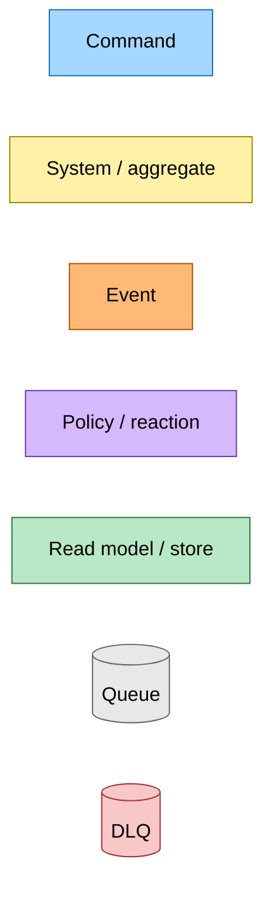
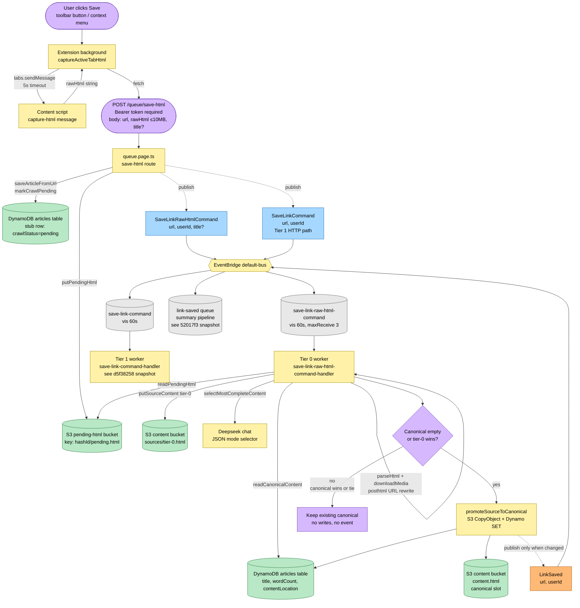
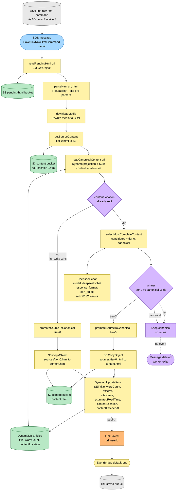
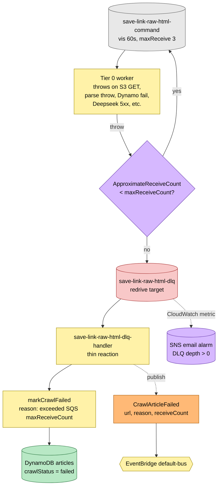

# Save-Link-Raw Flow — Event Storming

**Commit:** `bfd85c7` &nbsp;•&nbsp; **Commit date:** 2026-04-24 &nbsp;•&nbsp; **Generated:** 2026-04-24 &nbsp;•&nbsp; **Branch:** `main`
**Subject:** `feat(save-link): Tier 0 canonical promotion via Deepseek selector + DLQ consumer`

A point-in-time map of the **extension-originated** save path — when a logged-in user clicks *Save* in the Firefox or Chrome extension, the content script captures the **rendered DOM** of the active tab and the server stages it as a "Tier 0" source for that URL. Tier 0 then competes with whatever the HTTP crawler (Tier 1) produces for the same URL: a Deepseek JSON-mode selector picks the more complete body, and only the winner is promoted to the canonical `content.html`. If the SQS worker fails past `maxReceiveCount`, a dedicated DLQ consumer flips the article row to `crawlStatus=failed` and emits a `CrawlArticleFailed` event.

The broader article crawl pipeline (Tier 1 HTTP waterfall, Readability pre-parsers, anonymous `/view` and admin `/recrawl` entries, summary hand-off) is documented at [`../d5f38258/article-crawl-pipeline.md`](../d5f38258/article-crawl-pipeline.md). This snapshot zooms in on just the extension → raw-HTML → canonical-promotion → DLQ branch, which is net-new at this commit.

> Snapshots are historical. Any file path referenced below may have been renamed, moved, or deleted since this commit. Treat as an artefact, not a live guide.

---

## Legend

Mermaid source

---

## End-to-end flow — extension click to canonical write

From the moment the user clicks *Save* in the browser toolbar until the DynamoDB row carries a `contentLocation` pointing at the winning canonical HTML. The key design point: `POST /queue/save-html` publishes **two** commands in parallel — `SaveLinkRawHtmlCommand` (Tier 0, extension DOM) and the original `SaveLinkCommand` / `SaveAnonymousLinkCommand` chain (Tier 1, HTTP crawl). Whichever worker's output looks more complete wins the canonical slot.

Mermaid source

---

## Tier 0 worker internals — pending HTML to canonical decision

The `save-link-raw-html-command` SQS consumer runs this sequence for every message. The branch at the bottom — `readCanonicalContent → selector → promote vs keep` — is the core of the Tier 0 promotion policy introduced at this commit. Notice that `publishLinkSaved` is only called on the *promote* branch: re-drives of the same command, or losses to an already-written canonical, are silent no-ops that don't re-kick the summary pipeline.

Mermaid source

---

## Failure paths — retry, DLQ, crawl-failed

Readability parse throws and S3/Dynamo/Deepseek transient errors all propagate as thrown exceptions out of the worker. SQS retries the message up to `maxReceiveCount` (3 by default for `HutchSQSBackedLambda`); after that the message lands in the DLQ. The DLQ handler is a thin reaction that marks the article failed and publishes a `CrawlArticleFailed` event, mirroring the same shape the Tier 1 (`save-link-dlq`) handler uses — the UI layer consumes the event regardless of which tier produced the failure.

Mermaid source

---

## Command → System → Event(s) reference table

Every command in this flow, the system that handles it, the events it publishes, and the policy that turns each event into the next command. Read top-down to follow a single save.

| Command | Handled by | Reads / writes | Event(s) emitted | Triggers command(s) |
|---|---|---|---|---|
| `POST /queue/save-html` (HTTP, Bearer auth) | `queue.page.ts` save-html route | write: S3 pending-html bucket (pending.html), Dynamo articles (stub, crawlStatus=pending) | — (publishes two commands directly, no event) | `SaveLinkRawHtmlCommand`, `SaveLinkCommand` (Tier 1, parallel) |
| `SaveLinkRawHtmlCommand { url, userId, title? }` | Tier 0 SQS worker `save-link-raw-html-command-handler` | read: S3 pending-html, Dynamo articles; write: S3 sources/tier-0.html; conditional write: S3 content.html + Dynamo articles (SET contentLocation, title, wordCount, etc.); external call: Deepseek `deepseek-chat` JSON mode | `LinkSaved { url, userId }` **only when canonical changed** | `GenerateSummaryCommand` (via link-saved worker, summary pipeline) |
| `SaveLinkCommand { url, userId }` (Tier 1) | See [`../d5f38258/article-crawl-pipeline.md`](../d5f38258/article-crawl-pipeline.md) | HTTP crawl waterfall, Readability, markCrawlReady/Failed | `LinkSaved` | `GenerateSummaryCommand` |
| *(reaction, no command)* — Deepseek selector loss or tie | Same Tier 0 worker branch | read-only; decides to skip promotion | — | — (message deleted, summary pipeline not re-kicked) |
| *(reaction, no command)* — `maxReceiveCount` exceeded on raw-html queue | DLQ consumer `save-link-raw-html-dlq-handler` | write: Dynamo articles (SET crawlStatus=failed, reason) | `CrawlArticleFailed { url, reason, receiveCount }` | — (UI reads event for failure banner + retry affordance; SNS alarm fires on DLQ depth) |

---

## Notes on scope

- **Authenticated only.** `POST /queue/save-html` requires a Bearer token; there is no anonymous variant of the raw-HTML path. Anonymous saves (`SaveAnonymousLinkCommand`) still go through the Tier 1 HTTP waterfall.
- **Both tiers run in parallel.** The ingress route publishes `SaveLinkRawHtmlCommand` *and* the Tier 1 `SaveLinkCommand` for the same URL. Neither worker waits for the other; the Deepseek selector is the tiebreaker, and whichever worker finishes second sees a non-empty canonical and runs the contest.
- **LinkSaved is idempotent on "no change".** The summary pipeline is downstream of `LinkSaved`, so the conditional publish in the Tier 0 worker prevents redundant summary regenerations when Tier 0 loses the contest.
- **DLQ alarm is load-bearing.** The existing SNS email alarm on DLQ depth is the signal a real user's save got wedged past retries. The DLQ handler marking `crawlStatus=failed` is what unblocks the UI, not what notifies the operator.
