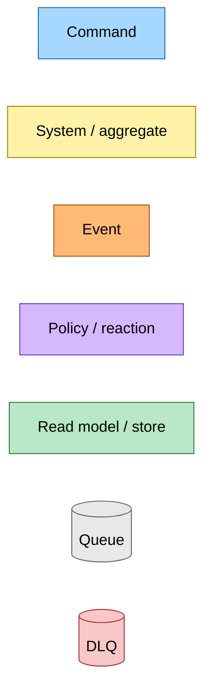
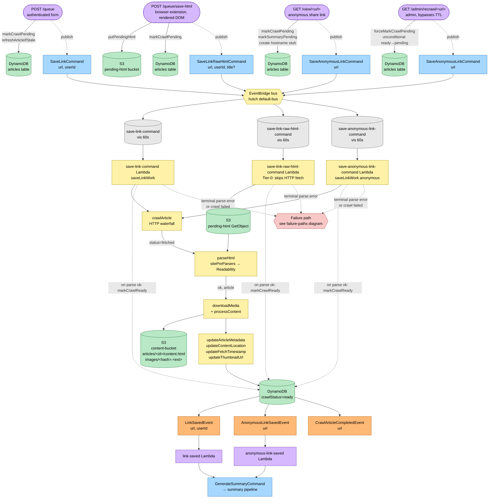
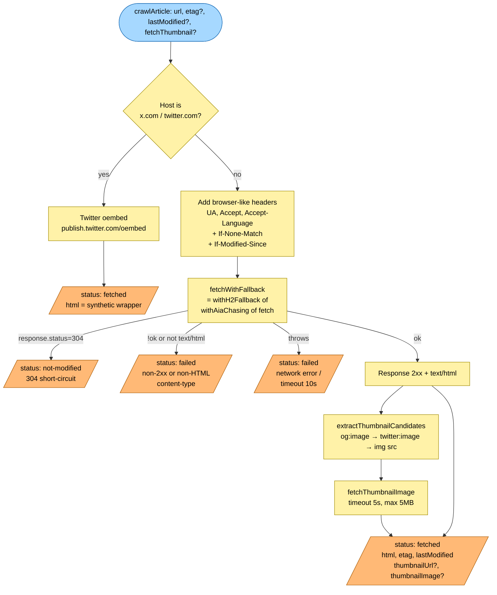
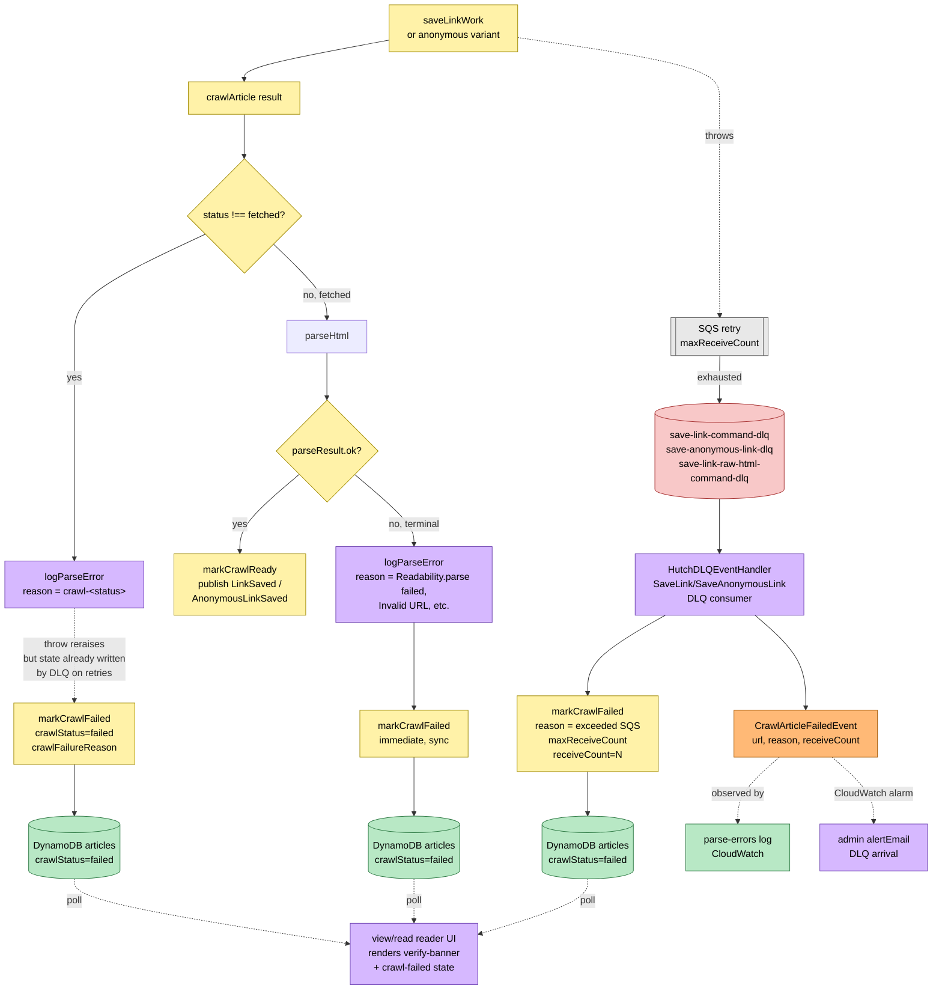

# Article Crawl Pipeline — Event Storming

**Commit:** `d5f38258` &nbsp;•&nbsp; **Commit date:** 2026-04-24 &nbsp;•&nbsp; **Generated:** 2026-04-24 &nbsp;•&nbsp; **Branch:** `main`
**Subject:** `fix(save-link): catch Readability.parse() throws in readability-parser`

A point-in-time map of how a URL becomes a parsed article row — from the moment a user clicks *Save* (or an anonymous visitor opens `/view/<url>`, or an admin hits `/admin/recrawl/<url>`) all the way to `crawlStatus=ready` (happy path) or `crawlStatus=failed` (terminal parse error or DLQ). The summary-generation pipeline is triggered at the boundary but lives in its own snapshot at [`../52017f3/summary-generation-pipeline.md`](../52017f3/summary-generation-pipeline.md).

> Snapshots are historical. Any file path referenced below may have been renamed, moved, or deleted since this commit. Treat as an artefact, not a live guide.

---

## Legend

Mermaid source

---

## End-to-end flow

Every entry point converges on the same **save-link worker shape** — `crawlArticle → parseHtml → markCrawlReady | markCrawlFailed → publish *LinkSaved`. The three commands differ only in *who triggered it* and *where the HTML comes from* (network vs. extension-captured DOM).

Mermaid source

---

## Tier 1+ crawl waterfall (inside `crawlArticle`)

The function tried for every non-Tier-0 URL. Twitter/X is handled via oembed because their JS shell has no content; everything else goes through an HTTP/2 + AIA-chasing fetch with browser-like headers to defeat Cloudflare/Fastly edge sniffing. `etag`/`last-modified` from the previous fetch power 304 short-circuit.

Mermaid source

---

## Parse + failure paths

Parse failures are terminal (re-running won't help) so the worker calls `markCrawlFailed` synchronously. Network/5xx failures are transient: the worker re-throws, SQS retries up to `maxReceiveCount`, and the DLQ handler flips the row to `failed` once retries are exhausted. The anonymous branch mirrors this exactly; only the published event name differs.

Mermaid source

---

## Command → System → Event(s) reference

| Command | Published from | Bus subscriber (SQS queue) | DLQ | Emits on success | Emits on failure | Triggers next command |
|---|---|---|---|---|---|---|
| `SaveLinkCommand` (url, userId) | `POST /queue` (authenticated) after `markCrawlPending` / `refreshArticleIfStale` | `save-link-command` (vis 60s) → `save-link-command` Lambda → `saveLinkWork` | `save-link-command-dlq` | `LinkSavedEvent` (url, userId), `CrawlArticleCompletedEvent` (url) | Terminal parse: `markCrawlFailed` inline. DLQ: `CrawlArticleFailedEvent` (url, reason, receiveCount) | `GenerateSummaryCommand` (via `link-saved` handler) |
| `SaveLinkRawHtmlCommand` (url, userId, title?) | `POST /queue/save-html` (authenticated browser extension) after `putPendingHtml` | `save-link-raw-html-command` (vis 60s) → `save-link-raw-html-command` Lambda — reads S3 pending-html, skips HTTP fetch | auto-pair via `HutchSQSBackedLambda` | `LinkSavedEvent` | Terminal parse: `markCrawlFailed` inline. DLQ: `CrawlArticleFailedEvent` | `GenerateSummaryCommand` (via `link-saved` handler) |
| `SaveAnonymousLinkCommand` (url) | `GET /view/<url>` (anonymous), or `GET /admin/recrawl/<url>` (admin, preceded by `forceMarkCrawlPending`) | `save-anonymous-link-command` (vis 60s) → `save-anonymous-link-command` Lambda → `saveLinkWork` anonymous | `save-anonymous-link-dlq` | `AnonymousLinkSavedEvent` (url), `CrawlArticleCompletedEvent` (url) | Terminal parse: `markCrawlFailed` inline. DLQ: `CrawlArticleFailedEvent` | `GenerateSummaryCommand` (via `anonymous-link-saved` handler) |
| `LinkSavedEvent` | emitted by `saveLinkWork` after `markCrawlReady` | `link-saved` (vis 60s) → `link-saved` Lambda | auto-pair | (dispatches) | (dispatches) | `GenerateSummaryCommand` onto `generate-summary` queue (out-of-scope, [`../52017f3/`](../52017f3/)) |
| `AnonymousLinkSavedEvent` | emitted by anonymous `saveLinkWork` after `markCrawlReady` | `anonymous-link-saved` (vis 60s) → `anonymous-link-saved` Lambda | auto-pair | (dispatches) | (dispatches) | `GenerateSummaryCommand` onto `generate-summary` queue |
| `CrawlArticleCompletedEvent` | emitted alongside `LinkSavedEvent` / `AnonymousLinkSavedEvent` | — (observed only) | — | — | — | — (signals Tier 1+ health canary + dashboards that crawl reached ready) |
| `CrawlArticleFailedEvent` | emitted by `HutchDLQEventHandler` after DLQ arrival **or** inline on terminal parse (via the same publish path in the DLQ handler scope) | parse-errors log consumers, admin alertEmail via CloudWatch alarm on DLQ | — | — | — | — (terminal; user must retry via admin recrawl) |
| `RefreshArticleContentCommand` (url, metadata, etag?, lastModified?, contentFetchedAt) | emitted by `refreshArticleIfStale` when re-saving a URL whose content window has expired | `refresh-article-content` (vis 60s) → `refresh-article-content` Lambda | auto-pair | (updates DynamoDB metadata) | — | — (side flow from web UI resave) |
| `UpdateFetchTimestampCommand` (url, contentFetchedAt) | emitted at the end of `saveLinkWork` (on happy path) | `update-fetch-timestamp` (vis 60s) → `update-fetch-timestamp` Lambda | auto-pair | (updates DynamoDB fetch timestamps) | — | — |

---

## Pipeline stages

**1. Entry & stub write.** The web layer creates or updates a hostname-only "stub" row in DynamoDB (`crawlStatus=pending`, minimal metadata). The stub exists so the reader UI (`/view`, `/read`) can render *something* immediately while the async pipeline catches up. The admin endpoint uses `forceMarkCrawlPending` — unlike regular `markCrawlPending`, it allows a `ready → pending` regression so an operator can force a re-crawl after fixing a pre-parser or canary.

**2. Command publish.** Each entry publishes exactly one of three commands to the EventBridge default bus (defined in `@packages/hutch-infra-components/src/events.ts`). The bus routes by `source` + `detailType`.

**3. SQS queue + Lambda worker.** `HutchSQSBackedLambda` wires each command's queue to a Lambda, with a DLQ attached and a CloudWatch alarm on DLQ arrival pointing at `alertEmail`. Visibility timeouts are 60s for every save-link queue (300s for `generate-summary`, which is the downstream summary pipeline).

**4. Content acquisition.** Tier 0 (`SaveLinkRawHtmlCommand`) fetches the extension-captured DOM from the `pending-html` S3 bucket — no HTTP fetch required, so Cloudflare/Fastly edge sniffing is bypassed entirely. Tier 1+ (`SaveLinkCommand`, `SaveAnonymousLinkCommand`) calls `crawlArticle`, which:
- Special-cases x.com/twitter.com via Twitter's oembed API (the JS app shell has no crawlable content).
- Otherwise runs `fetchWithFallback = withH2Fallback(withAiaChasing(fetch))` with browser-like headers (`user-agent`, `accept`, `accept-language`) required by Fastly/Cloudflare.
- Sends `if-none-match` / `if-modified-since` from the previous fetch so a 304 short-circuits the rest of the worker.
- Fetches the thumbnail image (5s timeout, 5 MB cap) if `fetchThumbnail=true`.

**5. Parse.** `parseHtml` in the readability-parser first runs the **pluggable site pre-parsers** (e.g. The Information extractor) — if any match the URL's hostname and return content, it is wrapped in a synthetic `<article>` document before Readability sees it. Readability is then invoked inside a try/catch; a throw maps to `{ ok: false, reason: 'Readability parse failed: …' }` (this is the fix behind commit `d5f38258`, the tip of HEAD). A terminal parse failure calls `markCrawlFailed` **inline** before re-throwing — so the reader sees the failed state on the next poll instead of waiting ~90s for SQS → DLQ.

**6. Ready path.** `downloadMedia` + `processContent` rewrite media URLs and download images into the `content-bucket`. `updateArticleMetadata`, `updateContentLocation`, `updateFetchTimestamp`, and (conditionally) `updateThumbnailUrl` write the row, then `markCrawlReady` flips `crawlStatus → ready`. The worker logs `"saved"` and returns — SQS deletes the message, and the worker publishes `LinkSavedEvent` / `AnonymousLinkSavedEvent` on the way out.

**7. Failure paths.**
  - **Terminal parse failure** — invalid URL, non-HTML content-type, Readability throw: `markCrawlFailed` + throw. The re-throw would land in DLQ on retries, but the row is already marked failed inline.
  - **Transient crawl failure** — network timeout, HTTP 5xx: `logParseError` + throw, no inline write. SQS retries `maxReceiveCount` times; on exhaustion the DLQ handler (`save-link-dlq`, `save-anonymous-link-dlq`) calls `markCrawlFailed` with `reason = "exceeded SQS maxReceiveCount"` and publishes `CrawlArticleFailedEvent`.
  - In both cases the reader UI polls DynamoDB, sees `crawlStatus=failed` + `crawlFailureReason`, and renders the failure banner with the summary slot hidden.

**8. Downstream summary dispatch.** `link-saved` / `anonymous-link-saved` Lambda handlers are minimal: they receive the post-ready event, look up the article, and dispatch `GenerateSummaryCommand` onto the `generate-summary` queue (see summary snapshot at [`../52017f3/summary-generation-pipeline.md`](../52017f3/summary-generation-pipeline.md)).

---

## Data stores

- **DynamoDB `articles`** — global table, PK = `url`. Crawl state attributes: `crawlStatus ∈ {pending, ready, failed}`, `crawlFailureReason`, `crawlFailedAt`, `contentFetchedAt`, `etag`, `lastModified`, `contentLocation` (S3 pointer). Content metadata: `title`, `siteName`, `excerpt`, `wordCount`, `estimatedReadTime`, `imageUrl`. Summary state attributes (managed by the summary pipeline) also live here: `summaryStatus`, `summary*`.
- **S3 `content-bucket`** — canonical parsed HTML and downloaded media. Keys: `articles/<articleResourceUniqueId>/content.html`, `articles/<articleResourceUniqueId>/images/<hash>.<ext>`. Served via the `content-media` CloudFront CDN (`HutchS3ContentMediaCDN`).
- **S3 `pending-html-bucket`** — staging for extension-captured raw DOM. Lifecycle-rule-eligible (can expire aggressively because it's not canonical). Read by the `save-link-raw-html-command` Lambda only.

## Queues (all under the `save-link` Pulumi stack)

| Queue | Visibility | DLQ | Purpose |
|---|---|---|---|
| `save-link-command` | 60s | `save-link-command-dlq` | Authenticated web-form saves |
| `save-link-raw-html-command` | 60s | auto-pair | Extension Tier-0 captures (reads S3 pending-html) |
| `save-anonymous-link-command` | 60s | `save-anonymous-link-dlq` | Anonymous `/view/<url>` + admin recrawl |
| `link-saved` | 60s | auto-pair | Dispatches `GenerateSummaryCommand` |
| `anonymous-link-saved` | 60s | auto-pair | Dispatches `GenerateSummaryCommand` (anonymous) |
| `refresh-article-content` | 60s | auto-pair | Side flow: re-saved URL past freshness TTL |
| `update-fetch-timestamp` | 60s | auto-pair | Happy-path post-save timestamp update |
| `generate-summary` | 300s | `generate-summary-dlq` | (downstream, see summary snapshot) |

---

## External dependencies

- `@mozilla/readability` — main parser. `reader.parse()` wrapped in try/catch as of `d5f38258`.
- `linkedom` — DOM parser for Readability input and thumbnail extraction.
- HTTP/2 + AIA-chasing `fetch` wrapper (`@packages/crawl-article`) — defeats edge sniffing (Cloudflare `cf-mitigated`, Fastly JA3 fingerprinting). The **crawler source health canary** (`src/packages/crawl-article/scripts/health-sources.js`) is load-bearing; every entry came from a real user URL that broke crawling — see [CLAUDE.md](../../CLAUDE.md) "Crawler Health Canary Is Load-Bearing".
- **Twitter oembed API** — `https://publish.twitter.com/oembed` for x.com/twitter.com.
- Site pre-parsers — pluggable `SitePreParser` interface with `matches({ hostname })` + `extract({ html })`. Current concrete: The Information extractor (`the-information-pre-parser.ts`). Added via `refactor: pluggable site pre-parser with The Information extractor`.
- **Mozilla Readability throw** fix (head of HEAD): specific failure reported against `hex.ooo/library/last_question.html` — `Cannot read properties of null (reading 'tagName')` inside `_grabArticle`.

---

## Key file citations

| Concern | Path |
|---|---|
| Event / command schemas | `src/packages/hutch-infra-components/src/events.ts` |
| Pulumi wiring (queues, Lambdas, DLQs, bus subs) | `projects/save-link/src/infra/index.ts` |
| Core worker | `projects/save-link/src/save-link/save-link-work.ts` |
| Parser + pre-parser plugin system + Readability try/catch | `projects/save-link/src/article-parser/readability-parser.ts` |
| The Information pre-parser (example plugin) | `projects/hutch/src/runtime/providers/article-parser/the-information-pre-parser.ts` |
| Tier 1+ HTTP waterfall | `src/packages/crawl-article/src/crawl-article.ts` |
| H2 fallback wrapper | `src/packages/crawl-article/src/h2-fetch.ts` |
| AIA chasing wrapper | `src/packages/crawl-article/src/aia-fetch.ts` |
| DynamoDB state transitions | `projects/save-link/src/crawl-article-state/dynamodb-article-crawl.ts` |
| SaveLink DLQ handler | `projects/save-link/src/crawl-article-state/save-link-dlq-handler.ts` |
| SaveAnonymousLink DLQ handler | `projects/save-link/src/crawl-article-state/save-anonymous-link-dlq-handler.ts` |
| Web entry: authenticated save | `projects/hutch/src/runtime/web/pages/queue/queue.page.ts` (`POST /queue`, `POST /queue/save-html`) |
| Web entry: anonymous view | `projects/hutch/src/runtime/web/pages/view/view.page.ts` |
| Web entry: admin recrawl | `projects/hutch/src/runtime/web/pages/admin/recrawl.page.ts` |
| Crawler health canary | `src/packages/crawl-article/scripts/health-sources.js` |
