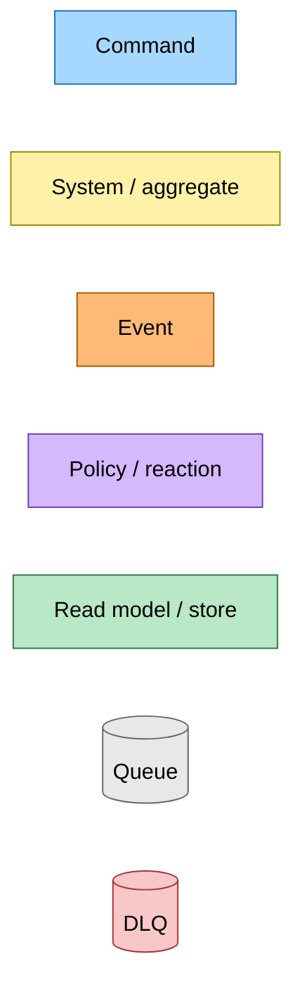
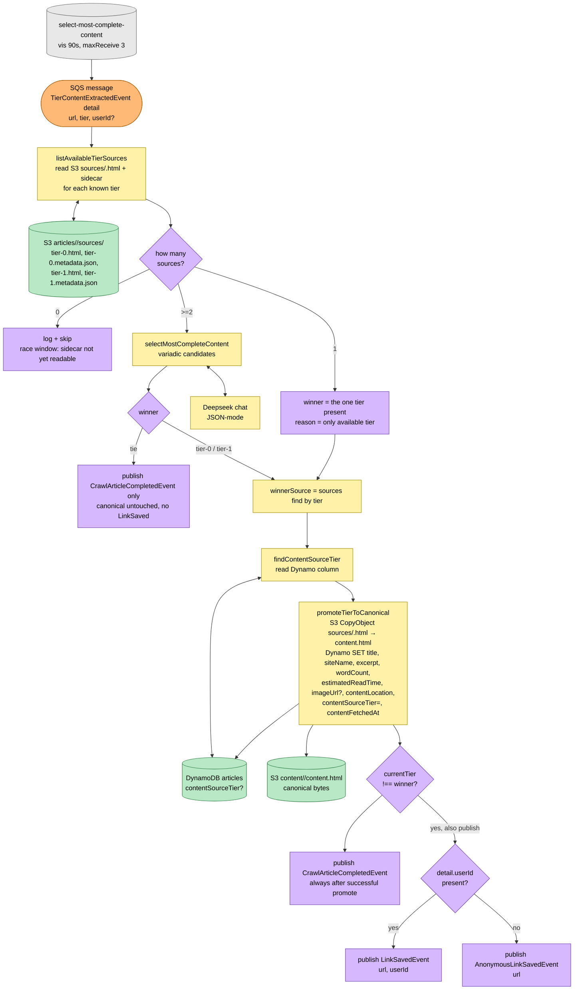
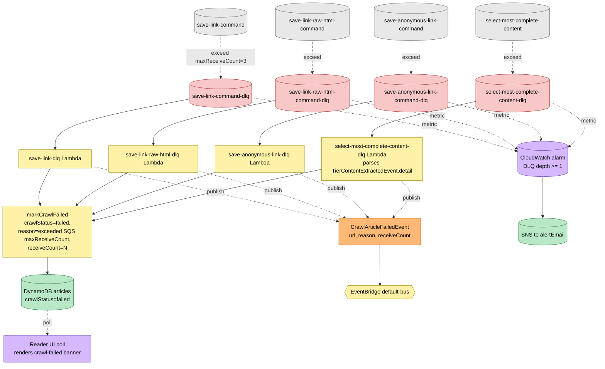

# Tier-Content Selector Flow — Event Storming

**Commit:** `f6d799c` &nbsp;•&nbsp; **Commit date:** 2026-04-25 &nbsp;•&nbsp; **Generated:** 2026-04-25 &nbsp;•&nbsp; **Branch:** `feat/tier-content-selector`
**Subject:** `feat: extract content selector into its own Lambda; tier sources are first-class`

A point-in-time map of the **post-refactor save-link pipeline**. The previous design (snapshots [`bfd85c7`](../bfd85c7/save-link-raw-flow.md) and [`d5f38258`](../d5f38258/article-crawl-pipeline.md)) had three asymmetries: (1) Tier 1 workers wrote canonical directly with no contest; (2) the Tier 0 worker ran an inline Deepseek selector against canonical, which only competed when canonical already existed; (3) admin recrawl re-ran only the Tier 1 path, so a paywalled origin would silently overwrite a strictly-better Tier 0 source. This snapshot replaces all three.

After this commit:

- Both Tier 0 and Tier 1 workers stop touching canonical. Each writes a per-tier source (`articles/<id>/sources/<tier>.html` + `<tier>.metadata.json` JSON sidecar), calls `markCrawlReady`, and emits the new past-tense `TierContentExtractedEvent`.
- A new `select-most-complete-content` Lambda subscribes to `TierContentExtractedEvent`. It is the **only** thing that promotes to canonical. It lists available tier sources from S3, runs Deepseek when there is competition, short-circuits when only one tier is present, and copies the winner's HTML + metadata to `content.html` + the article row, including a new `contentSourceTier` Dynamo column.
- The selector emits `LinkSavedEvent` (with `userId`) or `AnonymousLinkSavedEvent` (without) only when canonical changed, plus `CrawlArticleCompletedEvent` on every successful (non-tie) selection. The summary pipeline trigger moves with these events — `link-saved` / `anonymous-link-saved` event handlers continue to dispatch `GenerateSummaryCommand` exactly as before.
- Admin recrawl is unchanged at the entry-point layer. `forceMarkCrawlPending` already invalidates the freshness window; the existing `SaveAnonymousLinkCommand` path now writes a fresh `sources/tier-1.html`, dispatches the selector, and the selector reconsiders the prior `sources/tier-0.html` automatically. The admin recrawl page renders a "Showing Tier 0 / Tier 1 / legacy" badge from `contentSourceTier`.

> Snapshots are historical. Any file path referenced below may be renamed, moved, or deleted in the future. Treat as an artefact, not a live guide.

---

## Legend

Mermaid source

---

## End-to-end flow — entry to canonical via the selector

Every entry point still publishes one of the three save-link commands as before. What changed is what each worker *produces* (a per-tier source, not canonical) and where the canonical decision now lives (a dedicated event-handler Lambda fronted by EventBridge).

```mermaid
flowchart TD
    classDef command fill:#a6d8ff,stroke:#1e6fb8,color:#000
    classDef system  fill:#fff2a8,stroke:#a08a00,color:#000
    classDef event   fill:#ffb976,stroke:#a85800,color:#000
    classDef policy  fill:#d6b8ff,stroke:#6b3fb0,color:#000
    classDef store   fill:#b8e8c5,stroke:#2f7a45,color:#000
    classDef queue   fill:#e8e8e8,stroke:#666,color:#000
    classDef dlq     fill:#f8c8c8,stroke:#a83434,color:#000

    %% Entry points (unchanged)
    PostQ([POST /queue<br/>auth, refreshArticleIfStale]):::policy
    PostHtml([POST /queue/save-html<br/>extension Tier 0 ingest<br/>+ parallel Tier 1 fan-out]):::policy
    GetView([GET /view/<url><br/>anonymous, first-visit / legacy-stub heal]):::policy
    GetRecrawl([GET /admin/recrawl/<url><br/>forceMarkCrawlPending]):::policy

    %% Commands (unchanged shape)
    SLC[SaveLinkCommand<br/>url, userId]:::command
    SLRH[SaveLinkRawHtmlCommand<br/>url, userId, title?]:::command
    SAL[SaveAnonymousLinkCommand<br/>url]:::command

    PostQ -.publishLinkSaved.-> SLC
    PostHtml -.publishSaveLinkRawHtmlCommand.-> SLRH
    PostHtml -.publishLinkSaved fan-out.-> SLC
    GetView -.publishSaveAnonymousLink.-> SAL
    GetRecrawl -.publishSaveAnonymousLink.-> SAL

    %% EventBridge default-bus
    Bus{{EventBridge default-bus}}:::system
    SLC --> Bus
    SLRH --> Bus
    SAL --> Bus

    %% Worker queues
    QSL[(save-link-command<br/>vis 60s)]:::queue
    QSLR[(save-link-raw-html-command<br/>vis 60s)]:::queue
    QSAL[(save-anonymous-link-command<br/>vis 60s)]:::queue
    Bus --> QSL
    Bus --> QSLR
    Bus --> QSAL

    %% Workers (now: write per-tier source, no canonical)
    W1[save-link-command Lambda<br/>HTTP crawl + Readability]:::system
    W0[save-link-raw-html-command Lambda<br/>read pending HTML + Readability]:::system
    WA[save-anonymous-link-command Lambda<br/>HTTP crawl + Readability]:::system

    QSL --> W1
    QSLR --> W0
    QSAL --> WA

    %% S3 layout (per URL)
    S3Tier0[(S3 articles/<id>/sources/tier-0.html<br/>+ tier-0.metadata.json)]:::store
    S3Tier1[(S3 articles/<id>/sources/tier-1.html<br/>+ tier-1.metadata.json)]:::store

    W0 -- putTierSource --> S3Tier0
    W1 -- putTierSource --> S3Tier1
    WA -- putTierSource --> S3Tier1

    %% Workers also markCrawlReady so reader UI un-sticks immediately
    Articles[(DynamoDB articles<br/>crawlStatus=ready,<br/>contentSourceTier?)]:::store
    W0 -- markCrawlReady --> Articles
    W1 -- markCrawlReady --> Articles
    WA -- markCrawlReady --> Articles

    %% Each worker emits the new past-tense event
    TCE[TierContentExtractedEvent<br/>url, tier, userId?]:::event
    W0 -.publish.-> TCE
    W1 -.publish.-> TCE
    WA -.publish.-> TCE

    %% Selector subscribes via EventBridge
    TCE --> Bus
    QSel[(select-most-complete-content<br/>vis 90s)]:::queue
    Bus --> QSel

    Sel[select-most-complete-content Lambda<br/>event handler<br/>list sources, run Deepseek, promote]:::system
    QSel --> Sel
    Sel <-- listAvailableTierSources --> S3Tier0
    Sel <-- listAvailableTierSources --> S3Tier1

    %% Deepseek call (only when >=2 sources)
    DS[Deepseek chat<br/>JSON-mode selector<br/>variadic candidates]:::system
    Sel <-- selectMostCompleteContent --> DS

    %% Canonical write (only the selector touches this)
    S3Canon[(S3 content/<id>/content.html<br/>canonical)]:::store
    Sel -- promoteTierToCanonical<br/>S3 CopyObject + Dynamo SET --> S3Canon
    Sel --> Articles

    %% Terminal events
    LS[LinkSavedEvent<br/>url, userId]:::event
    ALS[AnonymousLinkSavedEvent<br/>url]:::event
    CAC[CrawlArticleCompletedEvent<br/>url]:::event
    Sel -.publish on canonical change<br/>userId present.-> LS
    Sel -.publish on canonical change<br/>no userId.-> ALS
    Sel -.publish every successful selection.-> CAC

    LS --> Bus
    ALS --> Bus
    CAC --> Bus

    %% Summary pipeline trigger (unchanged)
    QLS[(link-saved queue)]:::queue
    QALS[(anonymous-link-saved queue)]:::queue
    Bus --> QLS
    Bus --> QALS
    HLS[link-saved Lambda]:::system
    HALS[anonymous-link-saved Lambda]:::system
    QLS --> HLS
    QALS --> HALS
    GSC[GenerateSummaryCommand<br/>direct SQS dispatch]:::command
    HLS -. inline dispatch .-> GSC
    HALS -. inline dispatch .-> GSC
    GSC --> QGS[(generate-summary queue<br/>see 52017f3 snapshot)]:::queue
```

Mermaid source

---

## Selector Lambda internals — listing, contesting, promoting

The selector is the only Lambda that decides the canonical winner. It is purely an event handler: it does not dispatch any command. The promotion is two writes — `S3 CopyObject` + a Dynamo `UpdateItem` — and the terminal events are conditional on whether the canonical actually changed.

Mermaid source

---

## Failure paths — selector DLQ + worker DLQ shape unchanged

Each of the three workers retains its own DLQ handler that emits `CrawlArticleFailedEvent` after `maxReceiveCount` (3) exhaustions, exactly as before. The selector queue gets a fourth DLQ handler with the same shape — it parses the dead `TierContentExtractedEvent` to extract the URL, marks `crawlStatus=failed`, and publishes the same terminal `CrawlArticleFailedEvent`. CloudWatch alarms on every DLQ depth >= 1 page `alertEmail` via SNS.

Mermaid source

---

## Command → System → Event(s) reference

The save-link surface at this commit. The new event is `TierContentExtractedEvent`; the new Lambda is `select-most-complete-content`. `LinkSavedEvent` and `AnonymousLinkSavedEvent` keep their names but are now emitted by the selector, not by the workers.

| Command / Event | Published from | Bus subscriber (queue → Lambda) | DLQ + handler | Emits | Triggers next |
|---|---|---|---|---|---|
| `SaveLinkCommand { url, userId }` | web Lambda — `POST /queue` / `POST /queue/save` (after `refreshArticleIfStale`); also fan-out from `POST /queue/save-html` | `save-link-command` (vis 60s) → `save-link-command` Lambda → tier-1 worker | `save-link-command-dlq` → `save-link-dlq` Lambda | `TierContentExtractedEvent { tier: "tier-1", userId }` after writing source + sidecar + `markCrawlReady`; on terminal parse: `markCrawlFailed` inline. DLQ: `CrawlArticleFailedEvent` | `select-most-complete-content` Lambda |
| `SaveLinkRawHtmlCommand { url, userId, title? }` | web Lambda — `POST /queue/save-html` only, after `putPendingHtml` | `save-link-raw-html-command` (vis 60s) → tier-0 worker | `save-link-raw-html-command-dlq` → `save-link-raw-html-dlq` Lambda | `TierContentExtractedEvent { tier: "tier-0", userId }`; on terminal parse: `markCrawlFailed` inline. DLQ: `CrawlArticleFailedEvent` | `select-most-complete-content` Lambda |
| `SaveAnonymousLinkCommand { url }` | web Lambda — `GET /view/<url>` (first visit / legacy stub) and `GET /admin/recrawl/<url>` (after `forceMarkCrawlPending`) | `save-anonymous-link-command` (vis 60s) → anonymous tier-1 worker | `save-anonymous-link-command-dlq` → `save-anonymous-link-dlq` Lambda | `TierContentExtractedEvent { tier: "tier-1" }` (no userId); on terminal parse: `markCrawlFailed` inline. DLQ: `CrawlArticleFailedEvent` | `select-most-complete-content` Lambda |
| `TierContentExtractedEvent { url, tier, userId? }` | the three workers above, after writing per-tier source + sidecar + `markCrawlReady` | `select-most-complete-content` (vis 90s) → `select-most-complete-content` Lambda | `select-most-complete-content-dlq` → `select-most-complete-content-dlq` Lambda | `LinkSavedEvent` (when `userId` and canonical changed); `AnonymousLinkSavedEvent` (when no `userId` and canonical changed); `CrawlArticleCompletedEvent` (every successful non-tie selection); none on tie-with-existing-canonical | `link-saved` / `anonymous-link-saved` Lambda |
| `LinkSavedEvent { url, userId }` | `select-most-complete-content` Lambda (only on canonical change) | `link-saved` (vis 60s) → `link-saved` Lambda | auto-pair | (dispatches a command inline) | `GenerateSummaryCommand` directly to `generate-summary` queue (SQS `SendMessageCommand`, not EventBridge) — see [`../52017f3/`](../52017f3/) |
| `AnonymousLinkSavedEvent { url }` | `select-most-complete-content` Lambda (only on canonical change, no `userId`) | `anonymous-link-saved` (vis 60s) → `anonymous-link-saved` Lambda | auto-pair | (dispatches a command inline) | `GenerateSummaryCommand` directly to `generate-summary` queue |
| `CrawlArticleCompletedEvent { url }` | `select-most-complete-content` Lambda (every successful non-tie selection) | — (no in-app subscriber; observed by the Tier 1+ health canary out-of-band) | — | — | — |
| `CrawlArticleFailedEvent { url, reason, receiveCount }` | each of the 4 DLQ Lambdas (`save-link-dlq`, `save-link-raw-html-dlq`, `save-anonymous-link-dlq`, `select-most-complete-content-dlq`) | — (no in-app subscriber; CloudWatch alarm on DLQ-depth pages `alertEmail` via SNS in parallel) | — | — | — |

---

## What changed vs. the prior snapshots (highlighted)

This is the diff from the earlier `bfd85c7` (Tier 0 raw-html flow) and `d5f38258` (article crawl pipeline) snapshots. The "new" rows are this commit's additions; "moved" rows mark behavior that relocated.

| Concern | Before | After (this commit, **highlighted**) |
|---|---|---|
| Who promotes to canonical | Tier 1 workers wrote canonical directly; Tier 0 worker wrote canonical via inline Deepseek selector when canonical existed | **`select-most-complete-content` Lambda — the only path to canonical for any tier.** Always-on contest, including first-write. |
| What the workers write to S3 | Tier 1 → `content/<id>/content.html` (canonical, no metadata sidecar). Tier 0 → `articles/<id>/sources/tier-0.html` only | **All workers → `articles/<id>/sources/<tier>.html` + `<tier>.metadata.json` JSON sidecar.** No worker writes canonical. |
| Where `LinkSavedEvent` is published | Tier 1 worker (after `markCrawlReady`); Tier 0 worker (only when canonical changed in the inline selector) | **`select-most-complete-content` Lambda, only on canonical change.** Same name, different emitter. |
| Where `AnonymousLinkSavedEvent` is published | Anonymous Tier 1 worker | **`select-most-complete-content` Lambda, only on canonical change.** |
| Where `CrawlArticleCompletedEvent` is published | Tier 1 workers (every successful crawl) | **`select-most-complete-content` Lambda, every successful non-tie selection.** Canary semantics shift from "HTTP crawl succeeded" to "pipeline reached canonical". |
| New event | — | **`TierContentExtractedEvent { url, tier, userId? }`.** Past tense; routes via EventBridge to the selector's queue. |
| New Dynamo column | — | **`contentSourceTier` ("tier-0" \| "tier-1").** Written only by the selector. Undefined on legacy rows. |
| New S3 sidecar | — | **`articles/<id>/sources/<tier>.metadata.json`.** Carries title, siteName, excerpt, wordCount, estimatedReadTime, imageUrl. |
| Recrawl semantics | Tier 1-only — overwrote canonical even when a strictly-better Tier 0 source existed | **Tier 0 sources are reconsidered automatically.** `forceMarkCrawlPending` + the existing `SaveAnonymousLinkCommand` path now dispatches the selector, which sees both tiers and picks. |
| Admin UI | No tier indication | **`AdminRecrawlPage` renders a tier badge** (`Showing Tier 0 (extension capture)` / `Tier 1 (HTTP crawl)` / `Tier 1 (legacy)`). |
| Failure topology | 3 worker DLQs | **4 DLQs (3 worker + 1 selector), all `HutchDLQEventHandler`-shaped.** All four emit `CrawlArticleFailedEvent`. |

---

## Key file citations (this commit)

| Concern | Path |
|---|---|
| New event definition | `src/packages/hutch-infra-components/src/events.ts` (`TierContentExtractedEvent`) |
| Tier S3 key helper | `src/packages/article-resource-unique-id/src/index.ts` (`toS3SourceMetadataKey`) |
| Tier source storage providers | `projects/save-link/src/select-content/{put,read,list-available-}tier-source*.ts`, `tier{,-source}.types.ts` |
| Selector core | `projects/save-link/src/select-content/select-content.ts`, `select-content-prompt.ts` (variadic candidates) |
| Promote-to-canonical | `projects/save-link/src/select-content/promote-tier-to-canonical.ts` (writes `contentSourceTier` column) |
| Read current canonical tier | `projects/save-link/src/select-content/find-content-source-tier.ts` |
| Selector handler | `projects/save-link/src/select-content/select-most-complete-content-handler.ts` |
| Selector composition root | `projects/save-link/src/runtime/select-most-complete-content.main.ts` |
| Selector DLQ handler | `projects/save-link/src/select-content/select-most-complete-content-dlq-handler.ts` |
| Selector DLQ composition root | `projects/save-link/src/runtime/select-most-complete-content-dlq.main.ts` |
| Tier 1 auth worker | `projects/save-link/src/save-link/save-link-command-handler.ts` (emits `TierContentExtractedEvent`) |
| Tier 1 anonymous worker | `projects/save-link/src/save-link/save-anonymous-link-command-handler.ts` |
| Tier 0 worker | `projects/save-link/src/save-link-raw-html/save-link-raw-html-command-handler.ts` |
| Shared Tier 1 work | `projects/save-link/src/save-link/save-link-work.ts` (writes tier-1 source via `putTierSource`) |
| Pulumi wiring | `projects/save-link/src/infra/index.ts` (new selector Lambda + queue + DLQ + DLQ handler) |
| `contentSourceTier` Dynamo codec | `projects/hutch/src/runtime/providers/article-store/dynamodb-article-store.ts` |
| `GlobalArticleData` type | `projects/hutch/src/runtime/providers/article-store/article-store.types.ts` |
| Admin recrawl UI | `projects/hutch/src/runtime/web/pages/admin/recrawl.component.ts`, `recrawl.styles.css`, `recrawl.page.ts` |
| Recrawl badge route test | `projects/hutch/src/runtime/web/pages/admin/recrawl.route.test.ts` |
