# Investigation — EventBridge → SQS drops on save-link entry points

> Executes Plan 6. Phase 1 + Phase 2 (static, read-only) on the codebase at branch `claude/investigate-eventbridge-sqs-drops-h2IVL`. Phase 3 (CloudWatch operational audit) is deferred to the operator with the production AWS profile — flagged inline where verdicts depend on it. Phase 4 (remediation tickets) is enumerated at the end.

## TL;DR

Six **confirmed gaps** that can each leave a row non-terminal forever, ordered roughly by blast radius:

1. **EventBridge target has no `DeadLetterConfig`** — every rule routes to SQS via `event-bus.ts:75-80`, with no rule-side DLQ. EventBridge → SQS failures (queue policy mismatch, throttling, payload size > 256 KiB, transient AWS faults) are silently dropped and only visible via the `FailedInvocations` rule metric. **This is the single mechanism in the codebase that matches the message-loss hypothesis exactly.**
2. **HTTP-side publish failure leaves the row pending** — four of six entry points (`POST /queue`, `POST /queue/save`, `GET /view/<url>`, `GET /admin/recrawl/<url>`) write the article row + `markCrawlPending` *before* awaiting `publishEvent`. If `PutEvents` throws, the catch (or unhandled error) returns a user-facing failure, but the pending row is never compensated. Class #1 by symptom, not class #2. (The remaining two — `POST /queue/save-html` and `POST /import/:id/commit` — have distinct failure modes classified as Gap #6 and Gap #5 respectively.)
3. **`link-saved-handler` and `anonymous-link-saved-handler` skip on missing content** — `if (!content) continue;` deletes the SQS message without dispatching `GenerateSummaryCommand` or marking summary terminal. Race window between `promoteTierToCanonical` writing canonical metadata and the canonical S3 object being readable. Produces orphan `summaryStatus=pending`.
4. **`generate-summary-handler` skips on AI returning no text block** — `link-summariser.ts:105-108` returns `null` and the handler `continue`s without writing terminal state. Two sibling paths (lines 60-63, 112-116) correctly call `markSummarySkipped`; this branch does not.
5. **Import path catches per-URL errors but doesn't compensate** — `import.page.ts:188-203` runs `saveArticleFromUrl` per URL and `.catch(logError)`s. If `publishLinkSaved` fails mid-loop, the row was already stub-saved + `markCrawlPending` was written, but no `SaveLinkCommand` was dispatched. Plausible explanation for `#204`'s 14-row cluster.
6. **`POST /queue/save-html` dispatches *before* it saves the article row** — `queue.page.ts:377-384` puts pending HTML + publishes `SaveLinkRawHtmlCommand`, *then* calls `saveArticleFromUrl`. If `saveArticleFromUrl` throws (e.g. DDB write fails), the tier-0 worker still receives the command, fetches the pending HTML, writes tier-0 source, the selector promotes — all for a URL with no DDB row. Inverse ordering bug.

One **observed-safe** result worth recording:

- **Every queue has a DLQ → SNS alarm wired** (via `HutchSQSBackedLambda` in `hutch-sqs-backed-lambda.ts:66-80`). Once a message reaches the consumer-side DLQ, the operator gets paged. The drop only happens *upstream* of the consumer-side queue, never inside the EventBridge → SQS → Lambda → DLQ chain itself.

Two findings deferred to Phase 3 (operator running `aws` CLI against staging + prod):

- Whether any deployed rule's `EventPattern` has drifted from the `defineEvent` constants in `events.ts`.
- Whether `FailedInvocations > 0` is currently observed on any rule — that confirms whether gap #1 has actually fired in production, not just that it could.

## Scope and method

**In scope** (per Plan 6 §Goal): the HTTP → EventBridge → SQS → Lambda → next-hop EventBridge graph for every save-link entry point. **Out of scope** (per Plan 6): aggregate model migration, watchdog/sweeper design, fixes for any gap found (those become Phase 4 tickets).

**Method**: static read of `projects/save-link/src/`, `projects/hutch/src/runtime/`, and `src/packages/hutch-infra-components/src/`. Every audit row resolves to a file:line reference. No AWS CLI access was used — Phase 3 metric/policy verification is deferred. All verdicts are coded:

| Verdict | Meaning |
|---|---|
| ✅ Safe | Static audit confirms the hop cannot silently drop. |
| ❌ Gap | Static audit confirms a silent-drop vector. Becomes a Phase 4 ticket. |
| 🕓 Unknown | Static audit can't conclude; needs Phase 3 (CloudWatch metric or `aws` CLI inspection). |

## Phase 1 — entry-point chains

Every save-link entry point converges on the same selector chain (`select-most-complete-content-handler`), which is also the sole writer of `crawlStatus="ready"`. The chains differ in the *first* hop only.

| # | Entry point | First hop | Carries `userId` | DLQ row-mutator? |
|---|---|---|---|---|
| 1 | `POST /queue/save` (form) | `publishLinkSaved` → `SaveLinkCommand` | ✅ | `save-link-dlq-handler` ✅ |
| 2 | `POST /queue` (Siren — URL only) | `publishLinkSaved` → `SaveLinkCommand` | ✅ | `save-link-dlq-handler` ✅ |
| 3 | `POST /queue/save-html` (Siren — raw HTML) | `publishSaveLinkRawHtmlCommand` → `SaveLinkRawHtmlCommand` (+ in parallel: `publishLinkSaved` via `saveArticleFromUrl`) | ✅ | `save-link-raw-html-dlq-handler` ✅ |
| 4 | `GET /view/<url>` (anonymous read) | `publishSaveAnonymousLink` → `SaveAnonymousLinkCommand` (+ `publishStaleCheckRequested`) | ❌ | `save-anonymous-link-dlq-handler` ✅ |
| 5 | `GET /admin/recrawl/<url>` (admin) | `publishRecrawlLinkInitiated` → `RecrawlLinkInitiatedEvent` | ❌ | `recrawl-link-initiated-dlq-handler` ✅ |
| 6 | `POST /import/:id/commit` (bulk file) | per-URL `publishLinkSaved` → `SaveLinkCommand` | ✅ | `save-link-dlq-handler` ✅ |

> ⚠️ Plan 6 §1 listed `/view/<url>` and `/admin/recrawl/<url>` as `POST`. They are `GET`. See `view.page.ts:249` and `recrawl.page.ts:212`. The web-skill ban on GET side-effects is intentionally relaxed here because both rely on idempotent `saveArticleGlobally` / `forceMarkCrawlPending` semantics, but it does mean proxies and prefetchers re-fire the same publish — worth noting separately for the brittleness audit.

### Common downstream chain

Once the first hop's command is dispatched, every chain converges:

```mermaid
flowchart LR
  classDef cmd fill:#a6d8ff,stroke:#1e6fb8;
  classDef sys fill:#fff2a8,stroke:#a08a00;
  classDef evt fill:#ffb976,stroke:#a85800;
  classDef queue fill:#e8e8e8,stroke:#666;
  classDef dlq fill:#f8c8c8,stroke:#a83434;

  Cmd[SaveLink* /<br/>SaveAnonymousLink /<br/>SaveLinkRawHtml /<br/>RecrawlLinkInitiated]:::cmd
  Q1[(SQS queue)]:::queue
  W[save-link-worker /<br/>raw-html-worker /<br/>recrawl-worker]:::sys
  TCE[TierContentExtractedEvent /<br/>RecrawlContentExtractedEvent]:::evt
  Q2[(select-content queue)]:::queue
  Sel[select-most-complete-content /<br/>recrawl-content-extracted]:::sys
  LSE[LinkSavedEvent /<br/>AnonymousLinkSavedEvent /<br/>CrawlArticleCompletedEvent]:::evt
  Q3[(link-saved queue)]:::queue
  LSh[link-saved-handler]:::sys
  GSC[GenerateSummaryCommand]:::cmd
  Q4[(generate-summary queue)]:::queue
  GS[generate-summary-handler]:::sys
  SGE[SummaryGeneratedEvent]:::evt

  Cmd -->|EventBridge rule| Q1 --> W
  W -->|EventBridge PutEvents| TCE
  TCE -->|EventBridge rule| Q2 --> Sel
  Sel -->|promoteTierToCanonical writes crawlStatus=ready| LSE
  LSE -->|EventBridge rule| Q3 --> LSh
  LSh -->|SQS SendMessage<br/>direct dispatcher| Q4 --> GS
  GS -->|writes summaryStatus=ready| SGE

  Q1 -.->|maxReceiveCount| DLQ1[(DLQ + handler<br/>flips crawlStatus=failed)]:::dlq
  Q2 -.-> DLQ2[(DLQ + handler<br/>flips crawlStatus=failed)]:::dlq
  Q3 -.-> DLQ3[(no DLQ row-mutator —<br/>see Hop §6.3)]:::dlq
  Q4 -.-> DLQ4[(DLQ + handler<br/>flips summaryStatus=failed)]:::dlq
```



Two observations from this picture:

- **GenerateSummaryCommand is the only direct-SQS command in the system.** Every other transition flows EventBridge → SQS. So the EventBridge → SQS drop hypothesis applies to *every* hop in the diagram *except* the one between `link-saved-handler` and `generate-summary-handler`.
- **The `link-saved` and `anonymous-link-saved` queues have no DLQ row-mutator wired** — see `projects/save-link/src/infra/index.ts:447-490`. Their `HutchSQSBackedLambda` instances create a DLQ + alarm, but there's no `HutchDLQEventHandler` consuming from `linkSavedQueue.dlqArn` or `anonymousLinkSavedQueue.dlqArn`. If those queues exhaust to DLQ, the alarm fires but the row is never flipped to terminal — the row stays at `summaryStatus=pending` until the operator manually intervenes.

## Phase 2 — per-hop audit

The checklist from Plan 6 §Decision is applied below. Hop numbering follows that table. Each row points at a file:line; verdicts are coded ✅ / ❌ / 🕓.

### Hop 1 — HTTP handler → `publishEvent` / `dispatchCommand` (caller side)

| Entry point | Site | Awaited? | Pending row written before publish? | Compensation on publish failure? | Verdict |
|---|---|---|---|---|---|
| `POST /queue/save` | `queue.page.ts:419-427` | ✅ via `saveArticleFromUrl` | ✅ `markCrawlPending` at `save-article-from-url.ts:51` | ❌ `catch` only redirects with `error_code=save_failed`; row stays pending | ❌ Gap #2 |
| `POST /queue` (Siren) | `queue.page.ts:266-283` | ✅ via `saveArticleFromUrl` | ✅ same path | ❌ `catch` returns 500 Siren error; row stays pending | ❌ Gap #2 |
| `POST /queue/save-html` | `queue.page.ts:377-384` | ✅ `publishSaveLinkRawHtmlCommand` then `saveArticleFromUrl` | ❌ Order inverted: publish first, save row second | ❌ Tier-0 worker fires for a non-existent article row | ❌ Gap #6 |
| `GET /view/<url>` | `view.page.ts:128-142` | ✅ | ✅ `markCrawlPending` at line 138 | ❌ No `try/catch`; Express returns 500 and row stays pending | ❌ Gap #2 |
| `GET /admin/recrawl/<url>` | `recrawl.page.ts:116-118` | ✅ | ✅ `forceMarkCrawlPending` at line 116 | ❌ No `try/catch`; row force-marked pending stays pending | ❌ Gap #2 |
| `POST /import/:id/commit` | `import.page.ts:188-203` | ✅ per-URL | ✅ via `saveArticleFromUrl` | ❌ `.catch(logError)` swallows; row stays pending | ❌ Gap #5 |

**Verdict (Hop 1, across all entry points): ❌ Gap.** Every HTTP entry point writes `crawlStatus=pending` to the row before `await`-ing the EventBridge `PutEvents`. If `PutEvents` throws (transient AWS fault, IAM denial, payload too large for the raw-HTML path even before it reaches the bus), the row is left pending with no command in flight — no SQS queue will redeliver, no DLQ will fire, no canary will flag it for ~15 min, no operator email is sent.

The runtime publisher itself (`hutch-infra-components/src/runtime/index.ts:37-40`) correctly asserts `FailedEntryCount === 0` — that's not the bug. The bug is on the *caller* side: every entry point treats `publishEvent` failure as "tell the user it failed and move on", without rolling back the pending state-machine write. **This is a class #1 mechanism, not class #2.** It can produce orphan-pending rows even with EventBridge → SQS working perfectly.

### Hop 2 — EventBridge bus → rule

| Concern | Evidence | Verdict |
|---|---|---|
| Rule `source` matches `defineEvent.source` | `event-bus.ts:69-72` builds the pattern directly from `event.source` + `event.detailType` — both pulled from the same `defineEvent` constant the publisher uses. No drift possible at deploy time. | ✅ Safe |
| Rule `detail-type` matches `defineEvent.detailType` | Same — single constant. | ✅ Safe |
| Rule `State: ENABLED` | Pulumi never sets `State: DISABLED`. `aws.cloudwatch.EventRule` defaults to `ENABLED`. | ✅ Safe (modulo manual console drift — Phase 3) |
| Rule targets the correct queue ARN | `event-bus.ts:75-80` wires `aws.cloudwatch.EventTarget` to `target.queueArn` from the same `HutchSQSBackedLambda` instance the `subscribe(...)` call received. | ✅ Safe |

**Verdict (Hop 2): ✅ Safe.** Wire-format values are sourced from a single `defineEvent` constant on both publisher and rule sides; the only failure mode is manual console drift, which Phase 3's `aws events describe-rule` would surface. No code-level mechanism can drop here.

> 🕓 Phase 3 must still run `aws events describe-rule --event-bus-name <bus> --name <rule>` for every rule in `events.ts` and confirm `State: ENABLED` and `EventPattern` matches the constants. Until that runs, the verdict is conditional.

### Hop 3 — EventBridge rule → SQS target

| Concern | Evidence | Verdict |
|---|---|---|
| EventBridge target has a `DeadLetterConfig` | **None do.** `event-bus.ts:75-80` constructs `aws.cloudwatch.EventTarget` with `targetId`, `rule`, `eventBusName`, and `arn` only. The Pulumi resource supports `deadLetterConfig` but it is not set anywhere in the codebase (`grep -rn "deadLetterConfig\|DeadLetterConfig" projects src --include='*.ts'` returns nothing). | ❌ **Gap #1** |
| EventBridge IAM can write to SQS (queue policy) | `event-bus.ts:82-102` writes an `aws.sqs.QueuePolicy` for each subscription that allows `events.amazonaws.com` to `sqs:SendMessage` *only* when `aws:SourceArn = rule.arn`. Tight scope. | ✅ Safe |
| Payload size < 256 KiB | The raw-HTML path is the only candidate: extension can capture up to `MAX_RAW_HTML_REQUEST_BYTES` (multi-MB). However, `queue.page.ts:377-378` `putPendingHtml` first puts the HTML to S3, then publishes a `SaveLinkRawHtmlCommand` with only `{url, userId, title}` — well under 256 KiB. So the EventBridge payload itself is always small. | ✅ Safe |
| Throttling | EventBridge throttles at very high event rates; for save-link volumes this is not realistic. | ✅ Safe |

**Verdict (Hop 3): ❌ Gap #1.** This is the single static finding that matches the Plan 6 hypothesis exactly. Without `DeadLetterConfig` on the target, EventBridge-side failure delivering to the queue (the queue temporarily losing its policy, AWS-side throttling, etc.) produces a `FailedInvocations` metric blip with no preserved payload — invisible to the operator unless they're actively reading rule metrics.

The fix is one line per `eventBus.subscribe(...)`: a shared dead-letter SQS queue passed as `DeadLetterConfig.Arn` on the `EventTarget`. Pulumi supports it; the existing `HutchSQS` component can host it; existing `HutchDLQEventHandler` can consume it (or a new lightweight handler that just logs + alerts, since at this point the payload is the original event, not a DDB row to mutate).

### Hop 4 — SQS queue policy

Already verified inside Hop 3. **✅ Safe.**

### Hop 5 — SQS → Lambda event source mapping

| Concern | Evidence | Verdict |
|---|---|---|
| Mapping is `Enabled` | `hutch-sqs-backed-lambda.ts:49-54` constructs `aws.lambda.EventSourceMapping` with `eventSourceArn`, `functionName`, `batchSize`, `functionResponseTypes`. No `enabled: false` anywhere. AWS default is enabled. | ✅ Safe |
| Lambda role has `sqs:ReceiveMessage / DeleteMessage / GetQueueAttributes` | `hutch-sqs-backed-lambda.ts:34-47` attaches an inline role policy granting exactly those three actions on the queue ARN. Same policy attached to DLQ handlers via `hutch-dlq-event-handler.ts:53-66`. | ✅ Safe |
| `ReportBatchItemFailures` wired | `hutch-sqs-backed-lambda.ts:53` and `hutch-dlq-event-handler.ts:72` both set `functionResponseTypes: ["ReportBatchItemFailures"]`. Every handler returns `SQSBatchResponse` with `batchItemFailures: []` populated on per-record throws. With `batchSize: 1` everywhere (audited below), this is precautionary but free. | ✅ Safe |
| `batchSize` is reasonable | Confirmed `batchSize: 1` at every callsite via `grep "batchSize:" projects/save-link/src/infra/index.ts projects/hutch/src/infra/index.ts` — 22 occurrences, all `1`. | ✅ Safe |

**Verdict (Hop 5): ✅ Safe.**

### Hop 6 — Lambda concurrency / throttling

Static audit can't conclude reserved-concurrency or account-wide unreserved-concurrency state. **🕓 Unknown — Phase 3.** Run `aws lambda get-function-concurrency --function-name <fn>` per Lambda; check CloudWatch `Throttles` metric across all save-link functions.

### Hop 7 — SQS visibility timeout vs Lambda timeout

`visibilityTimeoutSeconds` is set per-queue; `timeout` is set per-Lambda. The AWS recommendation is `visibility ≥ 6 × Lambda timeout`. Several queues in this codebase use a 2× ratio with a deliberate comment:

```
// saveLinkWork-bearing queues use 360s visibility = 2× the 180s Lambda
// timeout (AWS guidance) so a long-running invocation never has the message
// re-delivered to a second worker before the first finishes.
```

That comment is **incorrect** about AWS guidance — AWS recommends 6× ([Lambda + SQS docs](https://docs.aws.amazon.com/lambda/latest/dg/with-sqs.html)). However, with `batchSize: 1` and well-behaved handlers (no in-flight publish after the timeout), 2× is *functionally* sufficient: if the Lambda finishes within its own timeout the message is deleted before visibility expires; if the Lambda times out, redelivery causes duplicate work, not a drop.

| Queue | Visibility | Lambda timeout | Ratio | Verdict |
|---|---|---|---|---|
| `save-link-command` | 360 | 180 | 2× | 🕓 Tolerable; not AWS-recommended |
| `save-anonymous-link-command` | 360 | 180 | 2× | 🕓 Tolerable |
| `save-link-raw-html-command` | 360 | 180 | 2× | 🕓 Tolerable |
| `recrawl-link-initiated` | 360 | 180 | 2× | 🕓 Tolerable |
| `select-most-complete-content` | 300 | 300 | **1×** | ❌ Risk |
| `recrawl-content-extracted` | 300 | 300 | **1×** | ❌ Risk |
| `generate-summary` | 300 | 300 | **1×** | ❌ Risk |
| `link-saved` | 60 | 30 | 2× | 🕓 Tolerable |
| `anonymous-link-saved` | 60 | 30 | 2× | 🕓 Tolerable |
| `stale-check-requested` | 60 | 30 | 2× | 🕓 Tolerable |
| `refresh-article-content` | 60 | 30 | 2× | 🕓 Tolerable |
| `summary-generated` | 60 | 10 | 6× | ✅ Safe |
| `summary-generation-failed` | 60 | 10 | 6× | ✅ Safe |
| `update-fetch-timestamp` | 60 | 10 | 6× | ✅ Safe |

**Verdict (Hop 7): ❌ Risk on the three queues with ratio 1×.** When `visibility = Lambda timeout`, a Lambda that runs to the very end of its budget races with SQS redelivery: the handler can be running its last `publishEvent` call at second 299, and a second Lambda picks up the same message at second 300. The first completes at ~300, deletes the message, but the second now also processes it — duplicate work, duplicate events. Whether this is a *drop* depends on idempotency of every downstream handler; if any handler treats a duplicate as a hard error and throws, that throw can cascade into SQS retry → DLQ → terminal-failed state for a record that already succeeded.

> The Deepseek timeout for both selectors is `240_000 ms` (`select-content/timeouts.ts:7`, `generate-summary/timeouts.ts:7`), which leaves 60s of headroom inside the 300s Lambda timeout. As long as Deepseek aborts before the Lambda timeout, the handler returns cleanly within budget. So the risk is gated on Deepseek not hanging *and* the post-call DDB/S3 ops finishing within 60s — both probable, neither guaranteed.

### Hop 8 — handler reachable-but-silent code paths

The class #1 audit (handler returns 200 to SQS without dispatching downstream or marking terminal). The findings are summarised in the TL;DR; this is the per-handler verdict matrix:

| Handler | File | Code path that returns without publish/throw | Terminal state written? | Verdict |
|---|---|---|---|---|
| `save-link-command-handler` | `save-link-command-handler.ts:75-82` | `result === "unsupported"` → `continue` | ✅ `markCrawlUnsupported` + `markSummarySkipped` inside `saveLinkWork` | ✅ Safe |
| `save-link-raw-html-command-handler` | `save-link-raw-html-command-handler.ts:60-79` | Parse failure → `markCrawlFailed` + `throw` | ✅ Throws → SQS retry → DLQ | ✅ Safe |
| `save-anonymous-link-command-handler` | `save-anonymous-link-command-handler.ts:78-82` | Same as save-link-command | ✅ Safe |
| `recrawl-link-initiated-handler` | `recrawl-link-initiated-handler.ts:78-82` | Same as save-link-command | ✅ Safe |
| `select-most-complete-content-handler` | `select-most-complete-content-handler.ts:43-61` | `sources.length === 0` → `throw` | ✅ Throws → SQS retry → DLQ handler | ✅ Safe |
|  | `select-most-complete-content-handler.ts:83-96` | Recrawl tie + existing canonical → publish `CrawlArticleCompletedEvent` + `continue` | ✅ Row already terminal `crawlStatus=ready` from prior selector run | ✅ Safe |
| `recrawl-content-extracted-handler` | `recrawl-content-extracted-handler.ts:50-63` | `sources.length === 0` → `throw` | ✅ Safe |
| **`link-saved-handler`** | `link-saved-handler.ts:23-24` | `content` missing → `continue` | ❌ No terminal write, no throw, SQS deletes the message | ❌ **Gap #3** |
| **`anonymous-link-saved-handler`** | `anonymous-link-saved-handler.ts:25-29` | Same | ❌ **Gap #3** |
| **`generate-summary-handler`** | `generate-summary-handler.ts:39-42` | `summarizeArticle` returns `null` (already summarised / skipped) — but **also** when the Deepseek response has no text block (`link-summariser.ts:105-108`) | ❌ "No text block" path returns `null` without `markSummarySkipped` | ❌ **Gap #4** |
| `stale-check-handler` | `stale-check-handler.ts:24-37` | All branches publish or log; no row state to leave pending | ✅ Safe |

The two silent-skip patterns are both produced by missing-data short-circuits without compensation. In `link-saved-handler`, `findArticleContent(detail.url)` reading from S3 can race the canonical-write (the selector writes the canonical-tier pointer in DDB *and then* publishes `LinkSavedEvent` — but the S3 CopyObject that produced the canonical body may not be readable yet). The fix is either: (a) throw on missing content so SQS redelivers, or (b) `markSummaryPending` already set the row terminal-ish; arguably the right move is to mark it `summarySkipped` with a "no canonical content readable" reason.

### Hop 9 — handler DLQ wiring

| Source queue | `HutchDLQEventHandler` wired? | Where |
|---|---|---|
| `saveLinkCommandQueue` | ✅ | `infra/index.ts:166-172` |
| `saveLinkRawHtmlCommandQueue` | ✅ | `infra/index.ts:221-227` |
| `saveAnonymousLinkCommandQueue` | ✅ | `infra/index.ts:268-274` |
| `selectMostCompleteContentQueue` | ✅ | `infra/index.ts:368-374` |
| `generateSummaryQueue` | ✅ | `infra/index.ts:414-420` |
| `recrawlLinkInitiatedQueue` | ✅ | `infra/index.ts:531-537` |
| `recrawlContentExtractedQueue` | ✅ | `infra/index.ts:582-588` |
| `staleCheckRequestedQueue` | ❌ | Documented intentional at `infra/index.ts:281-284` — stale-check failure must not flip crawlStatus |
| **`linkSavedQueue`** | ❌ | `infra/index.ts:447-454` — no DLQ row-mutator |
| **`anonymousLinkSavedQueue`** | ❌ | `infra/index.ts:483-490` — no DLQ row-mutator |
| `summaryGeneratedQueue` | ❌ | Pure metrics consumer; no row state to flip |
| `summaryGenerationFailedQueue` | ❌ | Same |
| `refreshArticleContentQueue` | ❌ | Writes timestamp only; no terminal axis |
| `updateFetchTimestampQueue` | ❌ | Same |

**Verdict (Hop 9): ❌ Gap on `linkSavedQueue` and `anonymousLinkSavedQueue`.** Both are intermediate queues between the selector and `generate-summary-handler`. Their job is to dispatch `GenerateSummaryCommand`. If those queues exhaust to DLQ (e.g. the direct-SQS dispatcher fails repeatedly), the DLQ alarm pages the operator — but the row's `summaryStatus` is never flipped to `failed`. The row stays `summaryStatus=pending` indefinitely, hidden from the reader UI's "summary failed" rendering path. Pair with gap #3 (silent skip on missing content) and these two queues become a class #2 trap for the summary axis: either silent skip *or* DLQ-arrival, both leave the row pending.

### Hop 10 — DLQ handler doesn't flip the row

For the seven queues that *do* have a `HutchDLQEventHandler`, the audit confirmed every record-success path writes terminal state. Code excerpts (one-liner per handler, full grep above in Phase 2.6 method notes):

- `save-link-dlq-handler.ts:37-44` — `markCrawlFailed` + `markSummaryFailed` + `publishEvent(CrawlArticleFailedEvent)`
- `save-anonymous-link-dlq-handler.ts` — same pattern
- `save-link-raw-html-dlq-handler.ts` — same pattern
- `recrawl-link-initiated-dlq-handler.ts` — same pattern
- `select-most-complete-content-dlq-handler.ts` — same pattern
- `recrawl-content-extracted-dlq-handler.ts` — same pattern
- `generate-summary-dlq-handler.ts` — `markSummaryFailed` + `publishEvent(SummaryGenerationFailedEvent)`

All seven catch errors per-record and push to `batchItemFailures` for SQS redelivery — no message lost between DLQ and handler.

**Verdict (Hop 10): ✅ Safe** for the wired DLQ handlers. (The unwired pair is captured under Hop 9.)

### Hop 11 — CloudWatch log group retention

`hutch-lambda.ts:129-140` constructs `aws.lambda.Function` without an accompanying `aws.cloudwatch.LogGroup` resource. AWS Lambda auto-creates `/aws/lambda/<function-name>` on first invocation and defaults retention to **Never expire**.

**Verdict (Hop 11): ✅ Safe for forensic purposes** (logs are kept indefinitely), **❌ Gap for governance** (Pulumi doesn't manage the resource, can't enforce retention or encryption later, and the operator pays for indefinite log storage). Not a drop risk for this investigation.

## Question 4 — should the EventBridge archive be enabled?

`grep -rn "EventArchive\|aws.cloudwatch.EventArchive" projects src --include='*.ts'` returns nothing. No archive is configured today.

**Recommendation: do not enable an archive.** Reasons:

1. The drop hypothesis is more cheaply tested by the synthetic-save experiment (Phase 3 step 5): save a known URL with a unique tag through each of the six entry points, then `filter-log-events` for that tag at every hop. Silence at hop N+1 after a clean log at hop N is a definitive drop, no archive needed.
2. Phase 2 already produced one **confirmed** silent-drop vector (Gap #1, missing target DLQ). Fixing that is strictly higher leverage than enabling archive — the target DLQ captures dropped payloads with their full envelope, replayable on demand, with no archive ongoing storage cost.
3. Phase 4 ticket #1 (add target DLQ) supersedes the archive's forensic value for this class of failure.
4. The codebase's wire-format constants (`defineEvent.source`, `defineEvent.detailType`) are deployment contracts. The Plan 6 §Risks already calls out that renaming them requires coordinated redeploys; an archive doesn't help with that — coordinated deploys do.

If the operator later wants to add an archive for a specific debugging session (e.g. "I want to replay last week's `RecrawlLinkInitiatedEvent`s through a new handler"), it's a one-line Pulumi addition (`aws.cloudwatch.EventArchive`) and a one-shot `aws events start-replay`. No need to keep it on by default.

## Phase 3 — what's still 🕓 Unknown (operator owns)

These rows on the audit can't be closed without production AWS access. Each is cheap to run with the `prod` and `staging` profiles:

1. **Rule pattern drift.** `aws events describe-rule --event-bus-name <bus> --name <rule-name>` for every rule listed in `events.ts`. Cross-check `EventPattern` against the constant values. Expected verdict: no drift; flag any discrepancy.
2. **Rule `State`.** Confirm `State: ENABLED` for every rule.
3. **Per-rule `FailedInvocations`.** `aws cloudwatch get-metric-statistics --metric-name FailedInvocations --namespace AWS/Events --dimensions Name=RuleName,Value=<rule> --start-time -30days --statistics Sum --period 86400`. **Non-zero values here are the smoking gun for Gap #1.**
4. **Per-rule `MatchedEvents` vs `Invocations`.** Same metrics call. `MatchedEvents > Invocations` over a window = rule-to-target drops.
5. **Per-queue `Sent` vs `Received` mismatch.** Same metrics namespace `AWS/SQS`. Mismatch indicates upstream loss.
6. **Per-Lambda `Throttles`.** Concurrency-related drops.
7. **Synthetic-save end-to-end test.** Save a tagged URL via each of the six entry points, watch CloudWatch logs at every hop with `aws logs filter-log-events --filter-pattern "<tag>"`. This is the definitive test.

I do not have the production AWS profile in this sandbox so steps 1–7 are not executed here. If the operator runs them and finds zero `FailedInvocations` and zero `Sent/Received` mismatch, then Gap #1 is real-but-latent (no actual drops observed yet) and class #2 is **falsified** for the historical window inspected. The remaining orphan-pending rows in `#267 / #272 / #214 / #204` would then all collapse onto class #1 — Gaps #2 through #6.

## Phase 4 — tickets to file

Each row below is a discrete remediation. Sequenced by leverage (highest first):

1. **#TKT-EVB-DLQ — Wire `DeadLetterConfig` on every EventBridge target.** Modify `event-bus.ts:75-80` to accept a shared `targetDlq: HutchSQS` and pass `deadLetterConfig: { arn: targetDlq.queueArn }` on the `EventTarget`. Add a single platform-stack-owned `HutchSQS` queue + `HutchDLQEventHandler` whose record-success path logs the source/detail-type/detail and pages the operator. This is the only ticket that closes class #2 by structural means.

2. **#TKT-LINK-SAVED-DLQ-HANDLER — Wire `HutchDLQEventHandler` on `linkSavedQueue` and `anonymousLinkSavedQueue`.** Pattern: `markSummaryFailed({ url, reason: "link-saved DLQ exhausted" })` + `publishEvent(SummaryGenerationFailedEvent)`. Mirrors the existing six handlers.

3. **#TKT-HTTP-PUBLISH-COMP — HTTP entry-point publish-failure compensation.** Touches six routes. Cleanest fix: order operations as `publish first, write row last` (inverse of current order) so a publish failure leaves no DDB residue. Alternative: wrap `publish` in a try/catch that calls `markCrawlFailed` if the publish throws. Note: this overlaps semantically with Plan 4's aggregate model — if Plan 4 lands first this ticket becomes a no-op.

4. **#TKT-HTML-ORDER — Reorder `POST /queue/save-html` to write the article row before dispatching `SaveLinkRawHtmlCommand`.** `queue.page.ts:377-384` currently fires the command first; flip to `saveArticleFromUrl` first, then `putPendingHtml`, then publish.

5. **#TKT-LINK-SAVED-RACE — Replace `if (!content) continue;` with `throw`** in `link-saved-handler.ts:24` and `anonymous-link-saved-handler.ts:26`. Forces SQS retry until canonical S3 lands, then DLQ exhaustion (now caught by ticket #2). Document the visibility-timeout interaction with maxReceiveCount.

6. **#TKT-SUMMARY-NO-TEXT-BLOCK — Replace `return null;` with `markSummarySkipped({ reason: "ai-no-text-block" })`** in `link-summariser.ts:107`. Brings the path in line with siblings on lines 62 and 114.

7. **#TKT-IMPORT-COMPENSATE — In `import.page.ts:188-203`, surface per-URL publish failures.** Either roll back the row (mark crawl failed) or accumulate the failed URLs in `skipped` so the operator sees them on `/queue` with the existing import banner.

8. **#TKT-VIS-RATIO — Raise visibility timeout for `select-most-complete-content`, `recrawl-content-extracted`, and `generate-summary` queues.** All three currently have visibility = Lambda timeout (300/300). Even keeping the 2× convention in the rest of the codebase would help: set visibility to 600s. Optionally bring everything to the AWS-recommended 6×.

9. **#TKT-LOG-RETENTION — Add explicit `aws.cloudwatch.LogGroup` per Lambda** in `hutch-lambda.ts:129-140`. Set retention explicitly (90 days for runtime Lambdas, indefinite for DLQ handlers if forensics matter). Bring the log group under Pulumi's management.

10. **#TKT-RULE-PATTERN-TEST — Integration test that asserts deployed rule patterns match `defineEvent` constants.** Per Plan 6 §4.5. Runs against staging on CI.

## Quick reference — answers to Plan 6 §Open questions

| Q | Answer | Confidence |
|---|---|---|
| Does any EventBridge rule have a `DeadLetterConfig` today? | **No.** Verified by static read of `event-bus.ts:75-80` and `grep` across the codebase. | High |
| Custom or default bus per environment? | **Custom bus per environment, isolated by AWS account.** Staging account `572337278115` → bus `hutch-event-bus-d187ebf`; prod account `278728209435` → bus `hutch-event-bus-4202fdd`. Cross-account bus collision is impossible. | High |
| Per-Lambda CloudWatch log retention? | **AWS default ("Never expire")** because no `aws.cloudwatch.LogGroup` resource is provisioned. Lambda auto-creates the log group on first invocation. Forensic evidence is therefore preserved indefinitely (good for Phase 3 retroactive analysis); operationally this means Pulumi doesn't manage log lifecycle. | High |
| Is the EventBridge archive enabled? | **No, and we recommend keeping it off.** The synthetic-save test (Phase 3 step 5) provides the same forensic value at zero ongoing storage cost; the target DLQ (Gap #1 remediation) captures dropped payloads with better fidelity than an archive. | High |
| On-call rotation for SNS DLQ-alarm page? | Operator receives emails, acts on them when convenient — already in scope. | n/a |

## Adversarial cases — status

From Plan 6 §"Adversarial cases":

- **HTTP handler returns 200 before `await publishEvent` resolves.** Audited. Every entry point `await`s through to `publishEvent`. Confirmed safe.
- **`PutEvents` partial failure inside a multi-entry batch.** Confirmed safe — `initEventBridgePublisher` (`hutch-infra-components/src/runtime/index.ts:24-41`) sends a single-entry `Entries` array per call. No caller batches. If a future caller does, the existing `assert(FailedEntryCount === 0)` is load-bearing per-entry.
- **`save-link-raw-html-command` over the 256 KiB SQS message limit.** Confirmed safe. The command payload is `{url, userId, title}`, well under 256 KiB. The raw HTML itself lives in S3 (`pendingHtmlBucket`) and the command carries only the URL; the worker fetches the HTML via `readPendingHtml`. Note: S3 upload is bounded by `MAX_RAW_HTML_REQUEST_BYTES` body-parser limit, not by SQS.
- **Command → Command across Lambda boundary.** Audited. The two direct dispatches (`dispatchGenerateSummary` in `link-saved-handler.ts:26`, `anonymous-link-saved-handler.ts:31`, and `recrawl-content-extracted-handler.ts:157`) are dispatches *triggered by an event* — these are Event → Command transitions, which the infrastructure-design skill allows. No Command → Command violations.
- **Lambda exits before in-flight `dispatch()` resolves.** Every handler `await`s its publish/dispatch before returning from the for-loop. Confirmed safe.
- **Cold-start race between event source mapping and Lambda init.** Out of static-audit reach. Lambda's init code requires env vars (`requireEnv`) which throw on missing values. A failed init would abort the invocation; the message stays in the queue and exhausts to DLQ per the normal retry budget. As long as the DLQ handler's init also succeeds, the row gets flipped to `failed`. If both crash on init in the same deploy, both queues silently fill — but that's a deploy-time bug, not a runtime drop, and `pnpm check-infra` catches missing config-derived env vars before deploy.
- **Operator-deployed dev/preview stack accidentally subscribing to prod EventBridge bus.** Confirmed safe by separate AWS accounts (see Q2 above).

## Verdict for the Plan 6 hypothesis

> *"Are messages actually being dropped between EventBridge and SQS?"*

**Yes — there is one structural mechanism that can drop them silently (Gap #1, missing target DLQ).** Phase 3 needs to confirm whether the mechanism has *actually fired* in production (`FailedInvocations` metric inspection), but the static evidence is sufficient to file the remediation.

**However, the orphan-pending row clusters in `#267 rows 1-2`, `#272 row 2`, `#214` (10 rows), `#204` (14 rows) are more parsimoniously explained by class #1** — HTTP-side publish-failure compensation gap (Gap #2), import-loop swallowed exceptions (Gap #5), link-saved silent skip (Gap #3), and summary no-text-block silent skip (Gap #4). All five are confirmed by file:line reading and require no AWS-side evidence.

If Plan 4 Phase 1+2 lands (handler-success-implies-dispatch via the aggregate model), Gaps #2, #3, #4, #5, and #6 collapse together. Gap #1 is structural to the bus layer and survives Plan 4 — wire the target DLQ regardless of Plan 4's progress.
